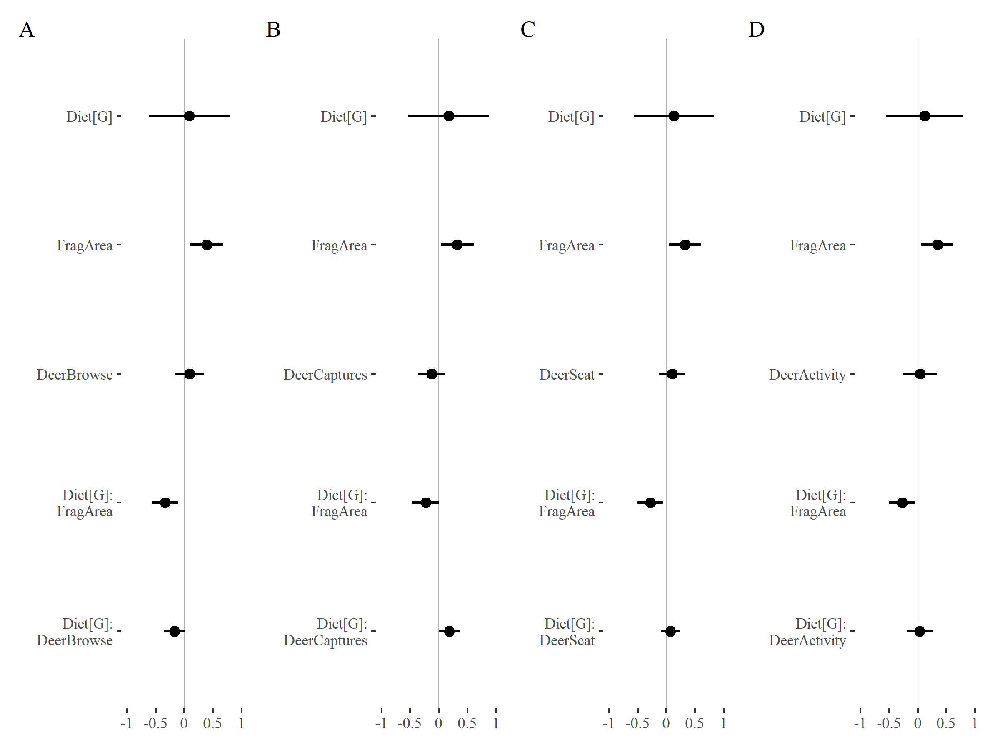
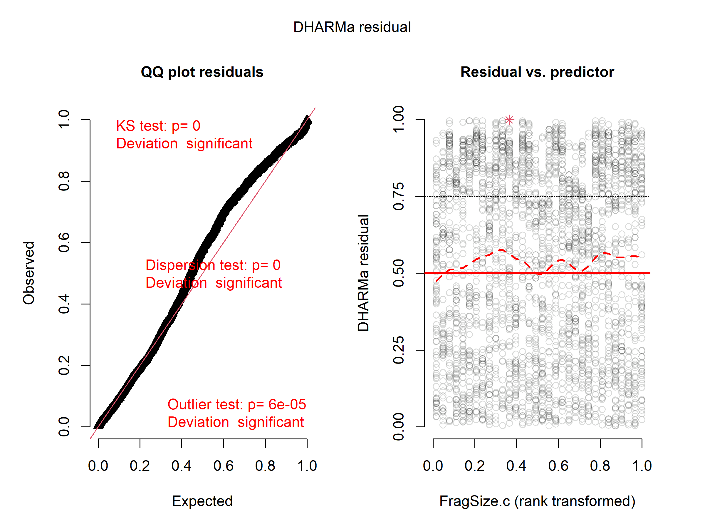

Fragmentation effects on Specialists
================
James Mickley & Robert Bagchi
October 14, 2024

  

- [Read in datasets](#read-in-datasets)
- [Data wrangling](#data-wrangling)
- [Data summaries](#data-summaries)
- [Name homogenization](#name-homogenization)
- [Calculate host density](#calculate-host-density)
- [Effects of fragment size on caterpillar
  density](#effects-of-fragment-size-on-caterpillar-density)
  - [Caterpillar abundance model](#caterpillar-abundance-model)
  - [Figures presenting model
    results](#figures-presenting-model-results)
  - [Variation among species in fragmentation
    effects](#variation-among-species-in-fragmentation-effects)
- [Alternative measures of deer
  effects](#alternative-measures-of-deer-effects)
- [Species richness and model](#species-richness-and-model)
- [Host abundance model](#host-abundance-model)
  - [Model of host abundance vs. fragment
    size.](#model-of-host-abundance-vs-fragment-size)
    - [Diagnostics for host-abundance
      model](#diagnostics-for-host-abundance-model)
  - [Deer effects on host abundance](#deer-effects-on-host-abundance)
  - [Plot of host abundance vs. fragment area and deer
    activity](#plot-of-host-abundance-vs-fragment-area-and-deer-activity)
- [Vegetation ordination](#vegetation-ordination)
  - [Ordination plot](#ordination-plot)
- [Session Info](#session-info)

# Read in datasets

# Data wrangling

Steps:

1.  Clean up species names of vegetation data.

2.  Add information on which ring vegetation plots are from.

3.  Calculate indices of deer pressure (deer captures, browse intensity
    and scat density).

4.  Add in data on host leaf area examined

Note, I set the minimum abundance here as 3 because intial analyses
suggested that the diagnostics get screwy with even rarer species.

``` r
## Set min number of records
min_N <- 3

## unique locations for points
vegdata %<>% mutate(PointLoc = str_split(PointID, "_")) %>% 
  mutate(PointLoc = map_int(PointLoc, .f = function(.x) as.integer(.x[3])))

## Clean up species names
vegdata$TreeSpecies[is.na(vegdata$TreeSpecies)] <- "XX"
vegdata %<>% filter(!is.na(TreeGenus)) ## get rid of unidentified trees as 
                                        # we can't do anything with them

# Make unique 5 letter species names for trees
vegdata$HostID <- toupper(paste0(str_sub(vegdata$TreeGenus, 1, 3),
                                  str_sub(vegdata$TreeSpecies, 1, 2)))

vegdata_ord <- vegdata # a copy of the vegetation data without homogenization
# of taxonomy with caterpillar data for use in ordination

## Tidy up the deer data (make names same as other data sets)
deer_abund %<>% rename("SiteID" = "site", "DeerCaptures" = "Deer_captures")

## Make a data frame with per site summaries (means) of deer variables
## Scat was repeated for each plant per point - taking unique values 
## and taking average per site.
deer_pres <- deer_browse %>% group_by(BlockID, SiteID, PointID, Year) %>% 
    summarize(ScatPiles = unique(ScatPiles[!is.na(ScatPiles)])) %>% 
    group_by(BlockID, SiteID) %>% summarize(ScatPiles = mean(ScatPiles)) 

## Building a model of deer browse vs site with plant species as a random effect
deer_browse_mod <- glmmTMB(Browsed/Plants ~ (1|BlockID) + (1|SiteID) + (1|PointID) + 
                               (1|PlantID), family = binomial, 
                           weights = Plants, data = deer_browse)

# use model to predict probability that a generic seedling is browsed by deer
deer_pres$BrowseProb <- plogis(fixef(deer_browse_mod)$cond + 
                                  ranef(deer_browse_mod)$cond$BlockID[deer_pres$BlockID,] +
                                  ranef(deer_browse_mod)$cond$SiteID[deer_pres$SiteID,])
# add to data on deer capture from camera traps
deer_pres %<>% left_join(deer_abund)

## and integrate into site data
sites %<>% rename("BrowseProb_old" = "BrowseProb") %>%  
    left_join(., deer_pres, by=c("BlockID", "SiteID")) %>% 
    relocate(ScatPiles:DeerCaptures, .after = "Hunted")

# Add scaled versions of fragmentation and deer metrics  to sites
sites %<>%
  # Scale variables for use in models
  mutate(
      # Add scaled fragment size, centered around 500 ha
      FragSize.c = as.vector(scale(FragSize, center = 500)),
      
      # Add scaled forest proportion, centered around 0.5
      ForestProp1km.c = as.vector(scale(ForestProp1km, center = 0.5)),
      
      # Add scaled fragmentation ratio, centered around 1
      FragRatio1km.c = as.vector(scale(FragRatio1km, center = 1)),
      
      # Log Fragment size, and scale, centered around 500 ha
      FragSize.Logc = as.vector(scale(log10(FragSize), center = log10(500))),
      
      # Deer metrics
      across(ScatPiles:ScatPredict, ~as.vector(scale(.x)), .names = "{.col}.c")
  )

## add number of plots at each site
sites <- vegdata %>% group_by(SiteID) %>% 
    summarise(nplots = n_distinct(PointLoc)) %>% 
    left_join(sites)

# Initial caterpillar data wrangling: add columns, filter rows
cat <- catdata %>%
    # Remove known bad host records
    filter(is.na(BadHost)) %>%
    # Add columns
    mutate(
        # Convert Year to a factor and set 2017 as the reference
        # 2015 last for sum contrasts
        Year = factor(Year, levels = c("2017", "2018", "2019", "2015")),
        # Some useful columns
      
        # Unique Branch ID
        BranchID = factor(paste(Year, PlotID, HostID, BranchNum, sep = "_")),
        
        # Make a binary specialist/generalist category based on wtMPD
        Diet = factor(ifelse(wtMPD < 100, "Specialist", "Generalist")), 
        
        # Make a column showing whether a taxa is species-level or not
        IsSpecies = ifelse(Species == "", FALSE, TRUE),
        
        # Predict the number of leaves from branch length/diam/species
        # Don't predict for 2015, data is not reliable
        Leaves.fit = ifelse(Year == 2015, NA, predict(branch.model, newdata = ., 
            allow.new.levels = TRUE, type = "response")),
        
        # If leaves were counted, use that. Otherwise use the prediction
        Leaves = ifelse(is.na(NumLeaves), Leaves.fit, NumLeaves),
        
        # Predict leaf area per leaf
        Area = ifelse(Year == 2015, NA, exp(predict(area.model, newdata = ., 
            allow.new.levels = TRUE))),
        
        # Calculate total leaf area
        LeafArea.Log = log(Area * Leaves)
        
    ) %>% 
  
    # Join scaled fragmentation metrics from site data
    left_join(sites %>% dplyr::select(SiteID, FragSize.c:ScatPredict.c), by = "SiteID") %>%
    
    # Select columns to keep & reorder
    dplyr::select(Year, BlockID, SiteID, PlotID, FragSize.c:ScatPredict.c, 
           HostID, BranchID, LeafArea.Log, CatID, IsSpecies, Diet, wtMPD, 
        Records, Count)

## summary of number of records per species
abund <- cat %>% group_by(CatID) %>% summarize(n_records = sum(Count)) %>% 
    filter(!is.na(CatID))

cat %<>% left_join(abund, by = "CatID") ## add n_records column
```

Clean up diet classification using Mike and Dave’s expertise

``` r
cat_diets <- dplyr::select(cat, CatID, Diet) %>% group_by(CatID) %>% 
    summarize(Diet = unique(Diet))
expert_diets <- dplyr::select(species_expert, SpeciesID, Specialist) %>% 
    mutate(CatID = SpeciesID)

## replace diet column with expert confirmed values
diet_c <- left_join(cat_diets, expert_diets) %>% 
    left_join(abund) %>% filter(!is.na(CatID))

table(diet_c$Specialist, diet_c$Diet, diet_c$n_records > 4, useNA = "ifany")
## , ,  = FALSE
## 
##       
##        Generalist Specialist <NA>
##   no           15         36    0
##   yes           3         40    0
##   <NA>          2         14    4
## 
## , ,  = TRUE
## 
##       
##        Generalist Specialist <NA>
##   no           42          5    0
##   yes           4         13    0
##   <NA>          5          1    6
```

``` r
## When both agree, doesn't matter (110 species)
##  When experts and observed diet disagree (48)
##  if < 5 records, go with expert opinion (39)


##  So all species with > 4 records go with data; all < 5 go with experts;
##  If < 5 and no expert opinion, NA

diet_c <- mutate(diet_c, 
                 Diet2 = case_when(
                     n_records >= 5 ~ Diet,
                     n_records < 5 & Specialist == "yes" ~ "Specialist",
                     n_records < 5 & Specialist == "no" ~ "Generalist", 
                     .default = NA_character_))

#diet_c$Diet[is.na(diet_c$Diet2)] <- NA
diet_c$agree <- ifelse(diet_c$Diet == diet_c$Diet2 | 
                           (is.na(diet_c$Diet) & is.na(diet_c$Diet2)), 1, 0)

table(diet_c$agree, cut(diet_c$n_records, c(1:10,10000)), useNA = "ifany")
##       
##        (1,2] (2,3] (3,4] (4,5] (5,6] (6,7] (7,8] (8,9] (9,10] (10,1e+04] <NA>
##   0        6     4     1     0     0     0     0     0      0          0   28
##   1       16     6    10     8     5     4     1     1      1         56   27
##   <NA>     2     1     0     0     0     0     0     0      0          0   13
```

``` r
## most disagreements are 1 or 2 records (> 4 is made to agree anyway)
cat$Diet <- as.factor(diet_c$Diet2[match(as.character(cat$CatID), diet_c$CatID)])
cat <- mutate(cat, Diet = relevel(Diet, "Specialist"))
```

# Data summaries

Summary data for beginning of results

``` r
cat %>% filter(Year != 2015) %>% 
    summarize(n_branches = length(unique(BranchID)),
              n_plantspecies = length(unique(HostID[!is.na(HostID)])),
              n_cats = sum(Count),
              n_catspecies = length(unique(CatID[!is.na(CatID)]))
              ) %>% kable()
```

| n_branches | n_plantspecies | n_cats | n_catspecies |
|-----------:|---------------:|-------:|-------------:|
|       9616 |             53 |  11165 |          176 |

``` r

cat %>% filter(Year != 2015) %>% group_by(Diet) %>% 
    summarize(n_cats = sum(Count),
              n_catspecies = length(unique(CatID[!is.na(CatID)]))
              ) %>% kable()
```

| Diet       | n_cats | n_catspecies |
|:-----------|-------:|-------------:|
| Specialist |    810 |           57 |
| Generalist |  10140 |           97 |
| NA         |    215 |           22 |

``` r

cat %>% filter(Year != 2015 & CatID == "LYMADI") %>% group_by(Year) %>% 
    summarize(n_cats = sum(Count)) %>% kable()
```

| Year | n_cats |
|:-----|-------:|
| 2017 |   6461 |
| 2018 |    729 |
| 2019 |    690 |

``` r

cat %>% filter(n_records >= min_N & Year != 2015 & 
                   !(CatID == "LYMADI" & Year == 2017)) %>% 
    group_by(Diet) %>% 
    summarize(n_cats = sum(Count),
              n_catspecies = length(unique(CatID[!is.na(CatID)]))
    ) %>% kable()
```

| Diet       | n_cats | n_catspecies |
|:-----------|-------:|-------------:|
| Specialist |    772 |           27 |
| Generalist |   3634 |           63 |
| NA         |    198 |            8 |

``` r
min_N ## min number of records for inclusion
## [1] 3
```

``` r
sp_list <- species %>% filter(Taxon == "Lepidoptera") %>%
    dplyr::select(-SPID, -Infraspecific) %>% 
    filter(!is.na(Records)) %>% arrange(Family, Genus, Species)
```

# Name homogenization

Homogenize the species ID codes and taxonomic resolution of the
caterpillar and tree datasets.

``` r
# 1.  lump together similar tree species that can't be unambiguously identified 
# 2. homogenize nomenclature for all data sets

# this table defines the conversions
treeGroups <- bind_rows(
    data.frame(HostID = c('ACESA', 'ACENI'), HostID_c = "ACEBL"), # combine sugar and black maple
    data.frame(HostID = c('BETAL', 'BETLE'), HostID_c = "BETBL"), # combine black and yellow birch
    data.frame(HostID = c('CARGL', 'CARTO', 'CARXX', 'CAROV'), HostID_c = "CARYA"), #combine hickories
    data.frame(HostID = c('CORCO', 'CORAM'), HostID_c = "CORYL"), # combine hazels
    #data.frame(HostID = c('FRAAM'), HostID_c = "FRAXX"), # set white ash to unknown
    data.frame(HostID = c('GAYBA', 'GAYXX'), HostID_c = "GAYLU"), # combine Huckleberries
    data.frame(HostID = c('PRUVI', 'PRUXX'), HostID_c = "PRUSE"), # set all cherries to black cherry
    data.frame(HostID = c('QUERU', 'QUEVE', 'QUECO'), HostID_c = "QUERE") # combine red oaks
    #data.frame(HostID = c('RUBAL'), HostID_c = "RUBXX") 
)

## convert names 
vegdata <- vegdata %>% mutate(
    HostID = case_when(
        HostID %in% treeGroups$HostID ~ 
            plyr::mapvalues(HostID, treeGroups$HostID, treeGroups$HostID_c), 
        TRUE ~ HostID)
)

cat2 <- cat %>% mutate(
    HostID = case_when(
        HostID %in% treeGroups$HostID ~ 
            plyr::mapvalues(HostID, treeGroups$HostID, treeGroups$HostID_c), 
        TRUE ~ HostID)
)
```

# Calculate host density

We now calculate the total density of hosts for each caterpillar
species.

First we document the hosts that lep species are found on at least
twice. Then we find the abundance of each of these hosts in each site,
before adding the abundances of all host species within a caterpillars
diet. Thus, if a species eats all maples, we compute the abundance of
maples at each site and use that as the density of possible hosts of the
species in the fragment.

These densities can then be modeled as a function of fragmentation
metrics to assess whether there are fewer hosts for specialist, but not
generalist, caterpillars in small forest fragments.

We do this at the scale of the nearest caterpillar plots

``` r
## matrix of who eats who
HostCatMat <- cat2 %>% filter(CatID != "") %>% count(CatID, HostID) %>% 
    mutate(n = ifelse(n > 1, 1, 0)) %>% # don't count single records
    spread(key = CatID, value = n, fill = 0)

## abundance of each host species in vegetation plots
HostAbund <- vegdata %>% group_by(BlockID, SiteID, HostID) %>% 
    filter(is.na(Dead) | Dead =="no" & PointLoc < 5) %>%
    count(.drop = FALSE)

## Basal area of each species in adjacent vegetation plots
HostBA <- vegdata %>% group_by(BlockID, SiteID, HostID) %>% 
    filter(is.na(Dead) | Dead =="no" & PointLoc < 5) %>%
    mutate(basal_area = ifelse(!is.na(DBH), pi*(0.5*DBH)^2, pi*0.05^2)) %>% 
    summarise(BA = sum(basal_area))

# Get rid of plants that aren't known hosts of any sampled caterpillars
# and that never occurred in the plots
HostCatMat <- HostCatMat[HostCatMat$HostID %in% unique(HostAbund$HostID),]
HostAbund %<>% filter(HostID %in% HostCatMat$HostID)
HostBA <- HostBA %>% filter(HostID %in% HostCatMat$HostID)

all(HostCatMat$HostID %in% HostAbund$HostID)  # check all hosts names are listed
## [1] TRUE
```

``` r
all(HostAbund$HostID %in% HostCatMat$HostID )  # check all hosts names are listed
## [1] TRUE
```

``` r
all(HostBA$HostID %in% HostCatMat$HostID )  # check all hosts names are listed
## [1] TRUE
```

``` r
all(HostCatMat$HostID %in% HostBA$HostID )  # check all hosts names are listed
## [1] TRUE
```

``` r

## function to efficiently calculate the number of host plants for each moth species
# uses matrix multiplication
hostDensCalc <- function(host_abund, host_cat_mat){
    site_host_mat <- host_abund %>% ungroup() %>% 
        dplyr::select(c(SiteID, HostID, n)) %>%
        pivot_wider(names_from = HostID, values_from = n, values_fill =  0)
    ## make sure host-cat matrix and site-host matrices have hosts in same order
    host_cat_mat %<>% arrange(as.character(HostID))     
    site_host_mat %<>%  dplyr::select(SiteID, as.character(host_cat_mat$HostID))

    stopifnot(all.equal(colnames(site_host_mat)[-1], 
                        as.character(host_cat_mat$HostID)))     
    
    site_cat_mat <- as.matrix(dplyr::select(site_host_mat, -SiteID)) %*% 
        as.matrix(dplyr::select(host_cat_mat, -HostID))
    site_cat_mat <- bind_cols(SiteID = site_host_mat$SiteID, site_cat_mat)
    site_cat_mat %<>% group_by(SiteID) %>% 
        pivot_longer(cols = -SiteID, names_to = "CatID", values_to = "N")
    return(site_cat_mat)
}

## 
host_abund <- left_join(hostDensCalc(HostAbund, HostCatMat), sites) %>% 
    mutate(nplots = 3)    # all sites have 3 plots in inner ring

host_BA <- left_join(hostDensCalc(
    rename(HostBA, "n" = "BA"), HostCatMat),
    sites) %>% 
    mutate(nplots = 3)    # all sites have 3 plots in inner ring

## get diet data for each moth species and merge it into host density data sets
#cat_diet <- cat %>% group_by(CatID) %>% summarise(Diet = unique(Diet))

# merge in diet info to the host abundance and basal area data
host_abund$Diet <- diet_c$Diet2[match(host_abund$CatID, diet_c$CatID)] 
host_BA$Diet <- diet_c$Diet2[match(host_BA$CatID, diet_c$CatID)]
```

# Effects of fragment size on caterpillar density

The central question of the paper is whether specialist abundance
respond more strongly to fragment area. Testing that here

First step is calculating the sampled leaf area per plot

``` r
## Total leaf area per site
# Need to calculate leaf area carefully - take data for unique branch ids, then
# transform to data scale, add them and transform back to log scale.
LeafArea <- cat %>%filter(Year != 2015) %>% mutate(Year = droplevels(Year)) %>%
    group_by(Year, BlockID, SiteID, BranchID) %>% 
    summarize(LeafArea = mean(unique(LeafArea.Log), na.rm=TRUE)) %>% ## use mean for 3 cases with 2 (almost identical) numbers
    group_by(Year, BlockID, SiteID) %>% 
    summarise(LeafArea.Log = log(sum(exp(LeafArea), na.rm = TRUE)))

# total leaf area of each branch - average across cat species because each 
# branch may be repeated, but always the same value (barring typos and rounding
# errors - hence the mean)
LeafArea_branch <- cat %>%filter(Year != 2015) %>% mutate(Year = droplevels(Year)) %>%
    group_by(Year, BlockID, SiteID, PlotID, BranchID) %>% 
    summarize(LeafArea.Log = mean(unique(LeafArea.Log), na.rm=TRUE))
```

## Caterpillar abundance model

Now we have the data for the model, we can start fitting it.

After playing around with the data a bunch, it seems like the model fits
a lot faster (unsurprisingly) and with better diagnostics, when we sum
caterpillars per site x species combination rather than at a per branch
level

``` r
# number of caterpillars per species per site, per year.
cat.pois_ag <- cat %>% filter(Year != 2015) %>% mutate(Year = droplevels(Year)) %>%  
    group_by(Year,  BlockID, SiteID, CatID, Diet) %>%
    summarize(Count = sum(Count)) %>% 
    filter(!is.na(Diet)) %>% mutate(CatID = droplevels(CatID)) # drop NA

## Need to add zeros - otherwise bias relationships by removing absences
cat.pois_ag %<>% ungroup() %>%  
    complete(Year, nesting(BlockID, SiteID), 
             nesting(CatID, Diet), 
             fill = list(Count = 0))

# Add leaf area data
cat.pois_ag %<>% left_join(LeafArea, by = c("Year", "BlockID", "SiteID")) 

## Add site level covariates and abundance data    
cat.pois_ag <- left_join(cat.pois_ag,
        dplyr::select(sites, SiteID, FragSize:ScatPredict, FragSize.c:ScatPredict.c), 
        by = c("SiteID")) %>% left_join(abund, by = "CatID")

## Calculate DeerActivity Using the average of all types (after standardization)
cat.pois_ag <-  rowwise(cat.pois_ag) %>% 
    mutate(DeerPressure.c = mean(c(ScatPiles.c, BrowseProb.c, DeerCaptures.c)))
```

``` r
## Fit model

## Lymantria seems to cause issues with diagnostics as do rare species (see below).
## Running a model without LYMADI and without species with n_records < 3 (other
## cut-offs give similar results.
nb.abund_frag_deer <- glmmTMB::glmmTMB(
    Count ~ offset(LeafArea.Log) + 
        Year + Diet * (FragSize.c + DeerPressure.c) +
        (1|BlockID/SiteID) + (1|CatID),
    family = glmmTMB::nbinom2,
    contrasts = list(Year = "contr.sum"),
    control=glmmTMB::glmmTMBControl(parallel = parallel::detectCores(),
                                    collect = FALSE),
    data = subset(cat.pois_ag, n_records >= min_N & 
                      !(CatID == "LYMADI" & Year == 2017 )))

summary(nb.abund_frag_deer) 
##  Family: nbinom2  ( log )
## Formula:          
## Count ~ offset(LeafArea.Log) + Year + Diet * (FragSize.c + DeerPressure.c) +  
##     (1 | BlockID/SiteID) + (1 | CatID)
## Data: subset(cat.pois_ag, n_records >= min_N & !(CatID == "LYMADI" &  
##     Year == 2017))
## 
##      AIC      BIC   logLik deviance df.resid 
##   9235.8   9320.5  -4605.9   9211.8     8596 
## 
## Random effects:
## 
## Conditional model:
##  Groups         Name        Variance Std.Dev.
##  SiteID:BlockID (Intercept) 0.1406   0.3749  
##  BlockID        (Intercept) 0.1682   0.4102  
##  CatID          (Intercept) 1.9718   1.4042  
## Number of obs: 8608, groups:  SiteID:BlockID, 32; BlockID, 13; CatID, 90
## 
## Dispersion parameter for nbinom2 family (): 0.282 
## 
## Conditional model:
##                                Estimate Std. Error z value Pr(>|z|)    
## (Intercept)                   -14.71085    0.32635  -45.08   <2e-16 ***
## Year1                          -0.50828    0.05551   -9.16   <2e-16 ***
## Year2                           0.06990    0.05101    1.37   0.1706    
## DietGeneralist                  0.11708    0.34560    0.34   0.7348    
## FragSize.c                      0.34076    0.14183    2.40   0.0163 *  
## DeerPressure.c                  0.04151    0.15106    0.27   0.7835    
## DietGeneralist:FragSize.c      -0.27685    0.11508   -2.41   0.0161 *  
## DietGeneralist:DeerPressure.c   0.03460    0.11610    0.30   0.7657    
## ---
## Signif. codes:  0 '***' 0.001 '**' 0.01 '*' 0.05 '.' 0.1 ' ' 1
```

``` r
Anova(nb.abund_frag_deer, 2) 
## Analysis of Deviance Table (Type II Wald chisquare tests)
## 
## Response: Count
##                        Chisq Df Pr(>Chisq)    
## Year                100.3415  2    < 2e-16 ***
## Diet                  0.6829  1    0.40859    
## FragSize.c            1.5225  1    0.21724    
## DeerPressure.c        0.2934  1    0.58803    
## Diet:FragSize.c       5.7871  1    0.01614 *  
## Diet:DeerPressure.c   0.0888  1    0.76568    
## ---
## Signif. codes:  0 '***' 0.001 '**' 0.01 '*' 0.05 '.' 0.1 ' ' 1
```

``` r
## Initial analyses suggested some variation in effects of fragmentation
## among years
nb.abund_frag_year <- glmmTMB::glmmTMB(
    Count ~ offset(LeafArea.Log) +
        Year * Diet * (FragSize.c + DeerPressure.c) +
        (1|BlockID/SiteID) + (1|CatID),
    family = glmmTMB::nbinom2,
    contrasts = list(Year = "contr.sum"),
    control=glmmTMB::glmmTMBControl(parallel = parallel::detectCores(),
                                    collect = FALSE),
    data = subset(cat.pois_ag, n_records >= min_N & !(CatID == "LYMADI" & Year ==2017) ))

summary(nb.abund_frag_year)
##  Family: nbinom2  ( log )
## Formula:          
## Count ~ offset(LeafArea.Log) + Year * Diet * (FragSize.c + DeerPressure.c) +  
##     (1 | BlockID/SiteID) + (1 | CatID)
## Data: subset(cat.pois_ag, n_records >= min_N & !(CatID == "LYMADI" &  
##     Year == 2017))
## 
##      AIC      BIC   logLik deviance df.resid 
##   9210.5   9365.8  -4583.2   9166.5     8586 
## 
## Random effects:
## 
## Conditional model:
##  Groups         Name        Variance Std.Dev.
##  SiteID:BlockID (Intercept) 0.1406   0.3749  
##  BlockID        (Intercept) 0.1697   0.4120  
##  CatID          (Intercept) 1.9679   1.4028  
## Number of obs: 8608, groups:  SiteID:BlockID, 32; BlockID, 13; CatID, 90
## 
## Dispersion parameter for nbinom2 family (): 0.293 
## 
## Conditional model:
##                                      Estimate Std. Error z value Pr(>|z|)    
## (Intercept)                         -14.79674    0.32782  -45.14  < 2e-16 ***
## Year1                                -0.84660    0.15061   -5.62  1.9e-08 ***
## Year2                                -0.05215    0.12898   -0.40  0.68596    
## DietGeneralist                        0.20199    0.34667    0.58  0.56012    
## FragSize.c                            0.33627    0.14484    2.32  0.02025 *  
## DeerPressure.c                        0.06849    0.15334    0.45  0.65514    
## Year1:DietGeneralist                  0.52089    0.17233    3.02  0.00251 ** 
## Year2:DietGeneralist                  0.10536    0.15259    0.69  0.48990    
## Year1:FragSize.c                     -0.04674    0.15403   -0.30  0.76155    
## Year2:FragSize.c                     -0.03884    0.13441   -0.29  0.77260    
## Year1:DeerPressure.c                  0.07057    0.15674    0.45  0.65254    
## Year2:DeerPressure.c                  0.05512    0.13867    0.40  0.69101    
## DietGeneralist:FragSize.c            -0.26339    0.11834   -2.23  0.02603 *  
## DietGeneralist:DeerPressure.c        -0.01370    0.11907   -0.12  0.90842    
## Year1:DietGeneralist:FragSize.c       0.15640    0.17668    0.89  0.37602    
## Year2:DietGeneralist:FragSize.c      -0.08509    0.15894   -0.54  0.59239    
## Year1:DietGeneralist:DeerPressure.c   0.23360    0.17683    1.32  0.18648    
## Year2:DietGeneralist:DeerPressure.c  -0.09247    0.16035   -0.58  0.56414    
## ---
## Signif. codes:  0 '***' 0.001 '**' 0.01 '*' 0.05 '.' 0.1 ' ' 1
```

``` r
Anova(nb.abund_frag_year, 2) ## no variation in effects of fragmentation among years.
## Analysis of Deviance Table (Type II Wald chisquare tests)
## 
## Response: Count
##                            Chisq Df Pr(>Chisq)    
## Year                     98.5950  2  < 2.2e-16 ***
## Diet                      0.5917  1  0.4417442    
## FragSize.c                1.5909  1  0.2072037    
## DeerPressure.c            0.3121  1  0.5763653    
## Year:Diet                25.4623  2  2.958e-06 ***
## Year:FragSize.c           2.1205  2  0.3463607    
## Year:DeerPressure.c      14.3324  2  0.0007722 ***
## Diet:FragSize.c           5.9519  1  0.0147011 *  
## Diet:DeerPressure.c       0.1052  1  0.7456439    
## Year:Diet:FragSize.c      0.7842  2  0.6756451    
## Year:Diet:DeerPressure.c  1.7753  2  0.4116233    
## ---
## Signif. codes:  0 '***' 0.001 '**' 0.01 '*' 0.05 '.' 0.1 ' ' 1
```

``` r
sim_res <- simulateResiduals(nb.abund_frag_deer, integerResponse = TRUE)
plot(sim_res) ## some issues although the qqplot distributions look okay.
```

<!-- -->

``` r
## residuals ~ predictions quantiles not working properly.
testQuantiles(sim_res) # seems okay
```

<!-- -->

    ## 
    ##  Test for location of quantiles via qgam
    ## 
    ## data:  simulationOutput
    ## p-value = 0.2818
    ## alternative hypothesis: both

``` r
testDispersion(sim_res) ## potentially problematic, but resolved by removing
```

<!-- -->

    ## 
    ##  DHARMa nonparametric dispersion test via sd of residuals fitted vs.
    ##  simulated
    ## 
    ## data:  simulationOutput
    ## dispersion = 1.7797, p-value = 0.176
    ## alternative hypothesis: two.sided

``` r
## Lymantria from 2017 and n < 3 species, without big changes in the results.
## Suggests the problem is being over-emphasized by the diagnostics
# sort(table(nb.abund_Frag$frame[outliers(sim_res), "CatID"])) ## nearly all lymantria
#testOutliers(nb.abund_Frag, type = "bootstrap") ## potentially problematic, 
# but resolved by removing Lymantria. I think this is a false positive.
testZeroInflation(sim_res) # fine
```

<!-- -->

    ## 
    ##  DHARMa zero-inflation test via comparison to expected zeros with
    ##  simulation under H0 = fitted model
    ## 
    ## data:  simulationOutput
    ## ratioObsSim = 1.0062, p-value = 0.832
    ## alternative hypothesis: two.sided

A couple of tests are “significant” but the plots don’t look bad once we
remove Lymantria 2017 and rare (n \< 3) species.

## Figures presenting model results

``` r
## plot from model
(deer_activity_plot <- 
     (
         data.frame(
             ggpredict(nb.abund_frag_deer, 
                       terms = c("FragSize.c [-1.3:1.3 by=0.05]", "Diet",
                                 "DeerPressure.c [c(-1, 1)]" ))) %>% 
             mutate(DeerPressure = factor(ifelse(facet == 1, "Low", "High"), 
                                          levels = c("Low", "High")),
                    FragSize = x * sd(sites$FragSize) + 500,
                    DeerLab = "Deer activity") %>% 
             ggplot(aes(x = FragSize, y = predicted, colour = group, 
                        linetype = group, fill = group, 
                        ymin = conf.low, ymax = conf.high)) +
             ggh4x::facet_nested(~ DeerLab + DeerPressure , scales = "free_y",
                                 nest_line = element_line()) +
             geom_ribbon(colour = NA, alpha = 0.3) + geom_line() +
             coord_trans(y = "log") +
             labs(x = "Fragment area (ha)",
                  y = expression(Caterpillar~density~(m^-2~leaf~area)),
                  colour = "Diet", fill = "Diet", linetype = "Diet", title = "A") +
             ggthemes::theme_tufte(base_size = 16)  + 
             theme(ggh4x.facet.nestline = element_line(colour = "grey"))) +
     (plot_model(nb.abund_frag_deer, transform = NULL,
                 rm.terms=c("Year1", "Year2"),
                 axis.labels = rev(c("Diet[G]", "FragArea","DeerActivity",
                                     "Diet[G]:\nFragArea", "Diet[G]:\nDeerActivity")),
                 vline.color = "grey70", colors = "black") + #ylim(0.5, 10) + 
          ggthemes::theme_tufte(base_size = 16) + 
          labs(title = NULL, y = "Estimate (log scale)") + ggtitle("B")))
```

<!-- -->

``` r

(deer_activity_plot <- deer_activity_plot + plot_layout(widths = c(2/3, 1/3)))
```

<!-- -->

``` r

ggsave(plot = deer_activity_plot, 
       filename = "figures/Fig2_DeerMeanActivityPlot.pdf",
    width = 8, height =5)
```

## Variation among species in fragmentation effects

Exploring variation among caterpillar species in response to
fragmentation.

``` r
## adding a random slope for frag size
nb.abund_frag_deer_rc <- glmmTMB::glmmTMB(
    Count ~ offset(LeafArea.Log) +  Year + 
        Diet * (FragSize.c + DeerPressure.c) +
        (1|BlockID/SiteID) + (FragSize.c|CatID), family = glmmTMB::nbinom2,
    contrasts = list(Year = "contr.sum"), 
    control=glmmTMB::glmmTMBControl(parallel = parallel::detectCores(),
                                    collect = FALSE),
    data = subset(cat.pois_ag, 
                  n_records >=min_N & !(CatID == "LYMADI" & Year == 2017)))

summary(nb.abund_frag_deer_rc) 
##  Family: nbinom2  ( log )
## Formula:          
## Count ~ offset(LeafArea.Log) + Year + Diet * (FragSize.c + DeerPressure.c) +  
##     (1 | BlockID/SiteID) + (FragSize.c | CatID)
## Data: subset(cat.pois_ag, n_records >= min_N & !(CatID == "LYMADI" &  
##     Year == 2017))
## 
##      AIC      BIC   logLik deviance df.resid 
##   9205.4   9304.3  -4588.7   9177.4     8594 
## 
## Random effects:
## 
## Conditional model:
##  Groups         Name        Variance Std.Dev. Corr 
##  SiteID:BlockID (Intercept) 0.1429   0.3780        
##  BlockID        (Intercept) 0.1773   0.4210        
##  CatID          (Intercept) 2.2031   1.4843        
##                 FragSize.c  0.3607   0.6006   0.29 
## Number of obs: 8608, groups:  SiteID:BlockID, 32; BlockID, 13; CatID, 90
## 
## Dispersion parameter for nbinom2 family (): 0.302 
## 
## Conditional model:
##                                Estimate Std. Error z value Pr(>|z|)    
## (Intercept)                   -14.97329    0.35088  -42.67   <2e-16 ***
## Year1                          -0.50403    0.05518   -9.13   <2e-16 ***
## Year2                           0.06824    0.05076    1.34    0.179    
## DietGeneralist                  0.27716    0.36998    0.75    0.454    
## FragSize.c                      0.15737    0.20421    0.77    0.441    
## DeerPressure.c                 -0.01573    0.15355   -0.10    0.918    
## DietGeneralist:FragSize.c      -0.16057    0.19788   -0.81    0.417    
## DietGeneralist:DeerPressure.c   0.07554    0.11705    0.65    0.519    
## ---
## Signif. codes:  0 '***' 0.001 '**' 0.01 '*' 0.05 '.' 0.1 ' ' 1
```

``` r
anova(nb.abund_frag_deer, nb.abund_frag_deer_rc) ## improves the model substantially
## Data: subset(cat.pois_ag, n_records >= min_N & !(CatID == "LYMADI" &  ...
## Models:
## nb.abund_frag_deer: Count ~ offset(LeafArea.Log) + Year + Diet * (FragSize.c + DeerPressure.c) + , zi=~0, disp=~1
## nb.abund_frag_deer:     (1 | BlockID/SiteID) + (1 | CatID), zi=~0, disp=~1
## nb.abund_frag_deer_rc: Count ~ offset(LeafArea.Log) + Year + Diet * (FragSize.c + DeerPressure.c) + , zi=~0, disp=~1
## nb.abund_frag_deer_rc:     (1 | BlockID/SiteID) + (FragSize.c | CatID), zi=~0, disp=~1
##                       Df    AIC    BIC  logLik deviance  Chisq Chi Df
## nb.abund_frag_deer    12 9235.8 9320.5 -4605.9   9211.8              
## nb.abund_frag_deer_rc 14 9205.4 9304.3 -4588.7   9177.4 34.383      2
##                       Pr(>Chisq)    
## nb.abund_frag_deer                  
## nb.abund_frag_deer_rc  3.419e-08 ***
## ---
## Signif. codes:  0 '***' 0.001 '**' 0.01 '*' 0.05 '.' 0.1 ' ' 1
```

``` r
## plot random slopes for each species
cat_reff <- tidy(nb.abund_frag_deer_rc, effects = "ran_vals") %>% 
    filter(group == "CatID")
cat_reff  <-  left_join(cat_reff, abund, by = c("level" = "CatID")) %>% 
    rename("n" = "n_records")
cat_reff$Diet <- as.factor(diet_c$Diet2[match(cat_reff$level, diet_c$CatID)])
    
cat_reff %<>% group_by(term, Diet) %>% 
    mutate(qq = rank(estimate))

cat_reff %<>% left_join(., 
                       group_by(catdata, CatID) %>% 
                           summarize(ScientificName = unique(ScientificName)),
                       by = c("level" = "CatID"))

## find main host for each caterpillar
main_host <- cat %>% group_by(CatID, HostID) %>%
    summarize(n = sum(Count, na.rm = TRUE)) %>%
    slice(which.max(n)) %>% dplyr::select(-n)
    
## Sort hosts by importance for specialists
specialist_importance <- filter(cat, !is.na(Diet)) %>% group_by(HostID, Diet) %>% 
    summarise(n = sum(Count, na.rm = TRUE)) %>% 
    pivot_wider(names_from = Diet, values_from = n, values_fill = 0) %>% 
    left_join(filter(species, Taxon == "Plantae") %>% 
                  select(PlantSciName = ScientificName, SpeciesID), 
              by = c("HostID" = "SpeciesID")) %>% 
    arrange(desc(Specialist)) %>% 
    filter(HostID %in% main_host$HostID)

main_host <- mutate(
    main_host, 
    PreferredHost = factor(HostID, 
                           levels = specialist_importance$HostID,
                           labels = specialist_importance$PlantSciName))

cat_reff <- left_join(cat_reff, main_host, by = c("level" = "CatID")) 
cat_reff %<>% mutate(ScientificName = gsub(" BOLD.*", "", ScientificName))
cat_reff$ScientificName[cat_reff$ScientificName == "Coryphista meadii"] <- "Rheumaptera meadii"
cat_reff %<>%  mutate(label = paste0(ScientificName, " [", n, "]"))
cat_reff <- cat_reff %>%  droplevels()

cat_reff$Diet <-  relevel(cat_reff$Diet, "Specialist")

## intercept not very interesting
blup_plot <- filter(cat_reff, term == "FragSize.c") %>% 
    mutate(estimate_c = ifelse(Diet == "Specialist", 
                               estimate +
                                   fixef(nb.abund_frag_deer_rc)$cond["FragSize.c"],
                               estimate +
                                   fixef(nb.abund_frag_deer_rc)$cond["FragSize.c"] +    
                        fixef(nb.abund_frag_deer_rc)$cond["DietGeneralist:FragSize.c"]
                        )) %>% 
    ggplot(aes(y = reorder_within(label, qq, term), x = estimate_c,
               xmin = estimate_c - std.error, xmax = estimate_c + std.error,
               color = PreferredHost, fill = PreferredHost, shape = PreferredHost)) +
    geom_vline(xintercept = 0, col = "grey50", linetype = "dotted") +
    geom_linerange(show.legend=FALSE) +
    geom_point(size = 3) +
    facet_wrap(~Diet, scales = "free_y") + 
    labs(x = "Area sensitivity (log scale)",
         y = "Lepidopteran species") +
    scale_y_reordered() +
    scale_x_continuous(breaks = seq(-1, 2, 1)) +
    scale_color_viridis_d(name = "Preferred Host", direction=-1) +
    scale_fill_viridis_d(name = "Preferred Host", direction=-1) +
    scale_shape_manual(values=c(15:17, 25, 23, 0:6, 8:14), 
                       name = "Preferred Host") + 
    ggthemes::theme_tufte(base_size = 12) + 
    theme(axis.text.y = element_text(face = "italic"),
          legend.text = element_text(face = "italic"))
        
ggsave(blup_plot, file =  "figures/Fig3_speciesblups.pdf", height = 9)

table(cat_reff$PreferredHost)
## 
##  Hamamelis virginiana           Acer rubrum      Kalmia latifolia 
##                    28                    16                    22 
##       Lindera benzoin  Vaccinium corymbosum  Carpinus caroliniana 
##                     6                    10                    52 
##     Clethra alnifolia     Ostrya virginiana     Lyonia ligustrina 
##                     2                     4                     2 
##         Pinus strobus          Betula lenta   Berberis thunbergii 
##                     4                    12                     2 
##       Corylus cornuta          Quercus alba     Fagus grandifolia 
##                     2                     4                     4 
##      Quercus velutina        Acer saccharum Betula alleghaniensis 
##                     2                     4                     2 
##     Corylus americana 
##                     2
```

``` r


filter(cat_reff, term == "FragSize.c" & Diet == "Specialist") %>% 
    ggplot(aes(y = reorder_within(level, qq, term), x = estimate,
                     xmin = estimate - std.error, xmax = estimate + std.error)) +
    geom_vline(xintercept = 0, col = "grey50", linetype = "dotted") +
    geom_pointinterval() +  scale_y_reordered() + 
    facet_wrap(~PreferredHost, scale = "free") +
    ggthemes::theme_tufte()
```

<!-- -->

``` r


## Is Epimecis having a disproportionate effect?
nb.abund_Frag_rc_red <-
    update(nb.abund_frag_deer_rc, 
           data = subset(cat.pois_ag, 
                         n_records >= 3 & 
                             !(CatID %in% c("EPIMHO" , "CORYME")) &
                             !(CatID == "LYMADI" & Year == 2017)))
                               
summary(nb.abund_Frag_rc_red) ## the lack of a difference is largely 
##  Family: nbinom2  ( log )
## Formula:          
## Count ~ offset(LeafArea.Log) + Year + Diet * (FragSize.c + DeerPressure.c) +  
##     (1 | BlockID/SiteID) + (FragSize.c | CatID)
## Data: subset(cat.pois_ag, n_records >= 3 & !(CatID %in% c("EPIMHO",  
##     "CORYME")) & !(CatID == "LYMADI" & Year == 2017))
## 
##      AIC      BIC   logLik deviance df.resid 
##   8983.4   9082.0  -4477.7   8955.4     8402 
## 
## Random effects:
## 
## Conditional model:
##  Groups         Name        Variance Std.Dev. Corr 
##  SiteID:BlockID (Intercept) 0.1652   0.4064        
##  BlockID        (Intercept) 0.2174   0.4663        
##  CatID          (Intercept) 2.1290   1.4591        
##                 FragSize.c  0.2217   0.4709   0.22 
## Number of obs: 8416, groups:  SiteID:BlockID, 32; BlockID, 13; CatID, 88
## 
## Dispersion parameter for nbinom2 family (): 0.317 
## 
## Conditional model:
##                                Estimate Std. Error z value Pr(>|z|)    
## (Intercept)                   -14.88816    0.35876  -41.50   <2e-16 ***
## Year1                          -0.49474    0.05528   -8.95   <2e-16 ***
## Year2                           0.05129    0.05095    1.01   0.3141    
## DietGeneralist                  0.20402    0.37049    0.55   0.5819    
## FragSize.c                      0.37506    0.19179    1.96   0.0505 .  
## DeerPressure.c                 -0.15476    0.16570   -0.93   0.3503    
## DietGeneralist:FragSize.c      -0.34454    0.17451   -1.97   0.0483 *  
## DietGeneralist:DeerPressure.c   0.18646    0.12367    1.51   0.1316    
## ---
## Signif. codes:  0 '***' 0.001 '**' 0.01 '*' 0.05 '.' 0.1 ' ' 1
```

``` r
## driven by Epimices  & Rheumaptera (specialists in small frags) 
```

Seems like there is considerable variation among lep species. In
particular, the specialists are a little right skewed. It is worth
noticing that the species that respond most negatively to fragment area
are Epimecis hortaria, which only ate Lindera benzoin in our data set
and Coryphista meadii, a barberry specialist. Given Barberry is an
invasive exotic, it represents a different mechanism. Epimices is
restricted to Lindera in our dataset, but according to Wagner it eats
Tulip tree (hence its common name Tulip-tree beauty). Perhaps this is an
example of local specialization a la Fox & Morrow?

# Alternative measures of deer effects

``` r
# measures of deer abundance
## plot of correlations among measures of deer pressure
sites2 <- rowwise(sites) %>% 
    mutate(DeerPressure.c = mean(ScatPiles.c:DeerCaptures.c))
with(sites2, cor.test(FragSize.c, DeerPressure.c))
## 
##  Pearson's product-moment correlation
## 
## data:  FragSize.c and DeerPressure.c
## t = -0.46173, df = 30, p-value = 0.6476
## alternative hypothesis: true correlation is not equal to 0
## 95 percent confidence interval:
##  -0.4203823  0.2726793
## sample estimates:
##         cor 
## -0.08400167
```

``` r

(deer_correlation_plot <- GGally::ggpairs(
    dplyr::select(sites2, FragSize.c, DeerPressure.c,
                  DeerCaptures.c, ScatPiles.c, BrowseProb.c), 
    lower = list(continuous = "smooth"), 
    columnLabels= c("Fragment Area", "Deer Activity", "Deer Captures", 
                    "Scat Piles", "Browse Probability"), 
    xlab = "Scaled value", ylab = "Scaled value") +
    ggthemes::theme_tufte())
```

<!-- -->

``` r

ggsave(deer_correlation_plot, file = "figures/fig_s2_deercorrelations.pdf")

with(sites, 
     {
         print(cor.test(FragSize.c, DeerCaptures.c))
         print(cor.test(FragSize.c, ScatPiles.c))
         print(cor.test(FragSize.c, BrowseProb.c))
     })
## 
##  Pearson's product-moment correlation
## 
## data:  FragSize.c and DeerCaptures.c
## t = -1.3805, df = 30, p-value = 0.1776
## alternative hypothesis: true correlation is not equal to 0
## 95 percent confidence interval:
##  -0.5465224  0.1140054
## sample estimates:
##        cor 
## -0.2444044 
## 
## 
##  Pearson's product-moment correlation
## 
## data:  FragSize.c and ScatPiles.c
## t = 0.22139, df = 30, p-value = 0.8263
## alternative hypothesis: true correlation is not equal to 0
## 95 percent confidence interval:
##  -0.3127101  0.3836784
## sample estimates:
##        cor 
## 0.04038772 
## 
## 
##  Pearson's product-moment correlation
## 
## data:  FragSize.c and BrowseProb.c
## t = -1.4736, df = 30, p-value = 0.151
## alternative hypothesis: true correlation is not equal to 0
## 95 percent confidence interval:
##  -0.55794788  0.09775071
## sample estimates:
##        cor 
## -0.2597985
```

``` r

## deer camera captures
nb.abund_deercaptures <- glmmTMB::glmmTMB(
    Count ~ offset(LeafArea.Log) +  Year + 
        Diet * (FragSize.c + DeerCaptures.c) +
    (1|BlockID/SiteID) + (1|CatID), family = glmmTMB::nbinom2,
    contrasts = list(Year = "contr.sum"),
    control=glmmTMB::glmmTMBControl(parallel = 20, collect = FALSE),
    data = subset(cat.pois_ag, 
                  n_records >= min_N, !(CatID == "LYMADI" & Year == 2017)))
summary(nb.abund_deercaptures)
##  Family: nbinom2  ( log )
## Formula:          
## Count ~ offset(LeafArea.Log) + Year + Diet * (FragSize.c + DeerCaptures.c) +  
##     (1 | BlockID/SiteID) + (1 | CatID)
## Data: subset(cat.pois_ag, n_records >= min_N, !(CatID == "LYMADI" &  
##     Year == 2017))
## 
##      AIC      BIC   logLik deviance df.resid 
##   9645.1   9729.9  -4810.5   9621.1     8628 
## 
## Random effects:
## 
## Conditional model:
##  Groups         Name        Variance Std.Dev.
##  SiteID:BlockID (Intercept) 0.1436   0.3789  
##  BlockID        (Intercept) 0.1894   0.4353  
##  CatID          (Intercept) 2.1584   1.4691  
## Number of obs: 8640, groups:  SiteID:BlockID, 32; BlockID, 13; CatID, 90
## 
## Dispersion parameter for nbinom2 family (): 0.281 
## 
## Conditional model:
##                                Estimate Std. Error z value Pr(>|z|)    
## (Intercept)                   -14.73251    0.34022  -43.30  < 2e-16 ***
## Year1                          -0.44176    0.05481   -8.06 7.67e-16 ***
## Year2                           0.03398    0.05137    0.66   0.5083    
## DietGeneralist                  0.17441    0.35986    0.48   0.6279    
## FragSize.c                      0.32218    0.14513    2.22   0.0264 *  
## DeerCaptures.c                 -0.12470    0.12031   -1.04   0.3000    
## DietGeneralist:FragSize.c      -0.23057    0.11559   -1.99   0.0461 *  
## DietGeneralist:DeerCaptures.c   0.18208    0.09194    1.98   0.0477 *  
## ---
## Signif. codes:  0 '***' 0.001 '**' 0.01 '*' 0.05 '.' 0.1 ' ' 1
```

``` r
Anova(nb.abund_deercaptures, 2)
## Analysis of Deviance Table (Type II Wald chisquare tests)
## 
## Response: Count
##                       Chisq Df Pr(>Chisq)    
## Year                81.4639  2    < 2e-16 ***
## Diet                 0.7068  1    0.40052    
## FragSize.c           1.7445  1    0.18657    
## DeerCaptures.c       0.0219  1    0.88234    
## Diet:FragSize.c      3.9790  1    0.04607 *  
## Diet:DeerCaptures.c  3.9222  1    0.04765 *  
## ---
## Signif. codes:  0 '***' 0.001 '**' 0.01 '*' 0.05 '.' 0.1 ' ' 1
```

``` r

nb.abund_scat <- glmmTMB::glmmTMB(
    Count ~ offset(LeafArea.Log) +  Year + 
        Diet * (FragSize.c + ScatPiles.c) +
    (1|BlockID/SiteID) + (1|CatID), family = glmmTMB::nbinom2,
    contrasts = list(Year = "contr.sum"),
    control=glmmTMB::glmmTMBControl(parallel = 20, collect = FALSE),
        data = subset(cat.pois_ag, 
                  n_records >= min_N, !(CatID == "LYMADI" & Year == 2017)))
summary(nb.abund_scat)
##  Family: nbinom2  ( log )
## Formula:          
## Count ~ offset(LeafArea.Log) + Year + Diet * (FragSize.c + ScatPiles.c) +  
##     (1 | BlockID/SiteID) + (1 | CatID)
## Data: subset(cat.pois_ag, n_records >= min_N, !(CatID == "LYMADI" &  
##     Year == 2017))
## 
##      AIC      BIC   logLik deviance df.resid 
##   9645.7   9730.5  -4810.9   9621.7     8628 
## 
## Random effects:
## 
## Conditional model:
##  Groups         Name        Variance Std.Dev.
##  SiteID:BlockID (Intercept) 0.1339   0.3659  
##  BlockID        (Intercept) 0.1630   0.4037  
##  CatID          (Intercept) 2.1567   1.4686  
## Number of obs: 8640, groups:  SiteID:BlockID, 32; BlockID, 13; CatID, 90
## 
## Dispersion parameter for nbinom2 family (): 0.28 
## 
## Conditional model:
##                             Estimate Std. Error z value Pr(>|z|)    
## (Intercept)                -14.72792    0.33562  -43.88  < 2e-16 ***
## Year1                       -0.44298    0.05483   -8.08 6.49e-16 ***
## Year2                        0.03341    0.05139    0.65   0.5157    
## DietGeneralist               0.13015    0.35923    0.36   0.7171    
## FragSize.c                   0.32451    0.14012    2.32   0.0206 *  
## ScatPiles.c                  0.10196    0.11552    0.88   0.3775    
## DietGeneralist:FragSize.c   -0.28288    0.11322   -2.50   0.0125 *  
## DietGeneralist:ScatPiles.c   0.07213    0.08415    0.86   0.3914    
## ---
## Signif. codes:  0 '***' 0.001 '**' 0.01 '*' 0.05 '.' 0.1 ' ' 1
```

``` r
Anova(nb.abund_scat, 2)
## Analysis of Deviance Table (Type II Wald chisquare tests)
## 
## Response: Count
##                    Chisq Df Pr(>Chisq)    
## Year             82.0212  2    < 2e-16 ***
## Diet              0.7225  1    0.39532    
## FragSize.c        1.1277  1    0.28826    
## ScatPiles.c       2.6453  1    0.10386    
## Diet:FragSize.c   6.2429  1    0.01247 *  
## Diet:ScatPiles.c  0.7346  1    0.39139    
## ---
## Signif. codes:  0 '***' 0.001 '**' 0.01 '*' 0.05 '.' 0.1 ' ' 1
```

``` r

nb.abund_browse <- glmmTMB::glmmTMB(
    Count ~ offset(LeafArea.Log) +  Year + 
        Diet * (FragSize.c + BrowseProb.c) +
    (1|BlockID/SiteID) + (1|CatID), family = glmmTMB::nbinom2,
    contrasts = list(Year = "contr.sum"),
    control=glmmTMB::glmmTMBControl(parallel = 20, collect = FALSE),
    data = subset(cat.pois_ag, 
                  n_records >= min_N, !(CatID == "LYMADI" & Year == 2017)))
summary(nb.abund_browse)
##  Family: nbinom2  ( log )
## Formula:          
## Count ~ offset(LeafArea.Log) + Year + Diet * (FragSize.c + BrowseProb.c) +  
##     (1 | BlockID/SiteID) + (1 | CatID)
## Data: subset(cat.pois_ag, n_records >= min_N, !(CatID == "LYMADI" &  
##     Year == 2017))
## 
##      AIC      BIC   logLik deviance df.resid 
##   9646.0   9730.7  -4811.0   9622.0     8628 
## 
## Random effects:
## 
## Conditional model:
##  Groups         Name        Variance Std.Dev.
##  SiteID:BlockID (Intercept) 0.1409   0.3753  
##  BlockID        (Intercept) 0.1914   0.4375  
##  CatID          (Intercept) 2.1603   1.4698  
## Number of obs: 8640, groups:  SiteID:BlockID, 32; BlockID, 13; CatID, 90
## 
## Dispersion parameter for nbinom2 family (): 0.28 
## 
## Conditional model:
##                              Estimate Std. Error z value Pr(>|z|)    
## (Intercept)                 -14.67211    0.34017  -43.13  < 2e-16 ***
## Year1                        -0.43940    0.05486   -8.01 1.15e-15 ***
## Year2                         0.03273    0.05143    0.64  0.52453    
## DietGeneralist                0.08486    0.36049    0.24  0.81390    
## FragSize.c                    0.38984    0.14428    2.70  0.00689 ** 
## BrowseProb.c                  0.08873    0.12756    0.70  0.48669    
## DietGeneralist:FragSize.c    -0.33549    0.11755   -2.85  0.00432 ** 
## DietGeneralist:BrowseProb.c  -0.16832    0.09671   -1.74  0.08179 .  
## ---
## Signif. codes:  0 '***' 0.001 '**' 0.01 '*' 0.05 '.' 0.1 ' ' 1
```

``` r
Anova(nb.abund_browse, 2)
## Analysis of Deviance Table (Type II Wald chisquare tests)
## 
## Response: Count
##                     Chisq Df Pr(>Chisq)    
## Year              80.7288  2  < 2.2e-16 ***
## Diet               0.7104  1   0.399307    
## FragSize.c         1.6001  1   0.205892    
## BrowseProb.c       0.0868  1   0.768325    
## Diet:FragSize.c    8.1462  1   0.004315 ** 
## Diet:BrowseProb.c  3.0289  1   0.081791 .  
## ---
## Signif. codes:  0 '***' 0.001 '**' 0.01 '*' 0.05 '.' 0.1 ' ' 1
```

``` r

deerbrowse_plot <- 
        plot_model(nb.abund_browse, transform = NULL, 
                   rm.terms=c("Year1", "Year2"),
                   axis.labels = rev(c("Diet[G]", "FragArea","DeerBrowse",
                                       "Diet[G]:\nFragArea", "Diet[G]:\nDeerBrowse")),
                   vline.color = "grey70", colors = "black") + #ylim(0.5, 10) + 
        ggthemes::theme_tufte() + labs(title = NULL, y = NULL)

deercap_plot <- 
        plot_model(nb.abund_deercaptures, transform = NULL, 
                   rm.terms=c("Year1", "Year2"),
                   axis.labels = rev(c("Diet[G]", "FragArea","DeerCaptures",
                                       "Diet[G]:\nFragArea", "Diet[G]:\nDeerCaptures")),
                   vline.color = "grey70", colors = "black") +# ylim(0.5, 10) + 
        ggthemes::theme_tufte() + labs(title = NULL, y = NULL)

deerscat_plot <- 
        plot_model(nb.abund_scat, transform = NULL,
                   rm.terms=c("Year1", "Year2"),
                   axis.labels = rev(c("Diet[G]", "FragArea","DeerScat",
                                       "Diet[G]:\nFragArea", "Diet[G]:\nDeerScat")),
                   vline.color = "grey70", colors = "black") + #ylim(0.5, 10) + 
        ggthemes::theme_tufte() + labs(title = NULL, y = NULL)


## Using the average of all types (after standardization)
((deerbrowse_plot | deercap_plot | deerscat_plot )| 
    (plot_model(nb.abund_frag_deer, transform = NULL, 
                rm.terms=c("Year1", "Year2"), 
                axis.labels = rev(c("Diet[G]", "FragArea","DeerActivity",
                                    "Diet[G]:\nFragArea", "Diet[G]:\nDeerActivity")),
                vline.color = "grey70",  colors = "black") +
         ggthemes::theme_tufte() + labs(title = NULL, y = NULL))) +
    plot_annotation(tag_levels = "A")
```

<!-- -->

``` r
## Paterns are similar in all cases

deer_comp_plot <- (deerbrowse_plot | deercap_plot | deerscat_plot ) +
        ggthemes::theme_tufte() + labs(title = NULL, y = NULL) +
    plot_annotation(tag_levels = "A")

ggsave(deer_comp_plot, file = "figures/fig_s3_deercompplot.pdf",
       width = 6, height = 2.5)
```

The effects of deer activity are a little complicated

- Mean deer activity measure has no effect on either diet.
- Specialists don’t respond to any metric.
- Generalists are affected in opposite directions by deer captures
  (positively!?) and deer browse (negatively, albeit marginally
  non-significantly). HOwever the effects are small, and they are
  not/barely signicant. Probably not a real effect.

# Species richness and model

``` r
richness.all <- cat %>% filter(Year != 2015 & n_records > min_N) %>% 
    mutate(Year = droplevels(Year)) %>%  
    # left_join(abund, by = "CatID") %>% 
    filter(!is.na(Diet) ) %>% mutate(CatID = droplevels(CatID)) %>% 
    group_by(BlockID, SiteID, Year, Diet, CatID) %>% 
    summarize(Count = sum(Count, na.rm = TRUE)) %>%
    ungroup() %>% 
    complete(Year, nesting(BlockID, SiteID), Diet,
         fill = list(Count = 0)) %>% 
    group_by(BlockID, SiteID, Year, Diet) %>% 
    summarize(species = n_distinct(CatID), 
              shannon = diversity(Count, index = "shannon"),
              invsimpsons = diversity(Count, index = "simpson")) %>%  
    left_join(LeafArea, by = c("Year", "BlockID", "SiteID")) %>% 
    left_join(
        dplyr::select(sites, SiteID, FragSize:ScatPredict, FragSize.c:ScatPredict.c), 
        by = c("SiteID")) %>% 
    mutate(Diet = relevel(Diet, "Specialist"),
           DeerPressure.c = mean(c(DeerCaptures.c, ScatPiles.c, BrowseProb.c)))
    
mod_rich_all <- glmmTMB(species ~ #offset(LeafArea.Log) + 
                            Year +
                        Diet * (FragSize.c + DeerPressure.c) +
                        (1|BlockID/SiteID), 
                    family = nbinom2, 
                    contrasts = list(Year = "contr.sum"), 
                    data = richness.all)

summary(mod_rich_all)
##  Family: nbinom2  ( log )
## Formula:          species ~ Year + Diet * (FragSize.c + DeerPressure.c) + (1 |  
##     BlockID/SiteID)
## Data: richness.all
## 
##      AIC      BIC   logLik deviance df.resid 
##    886.0    921.9   -432.0    864.0      181 
## 
## Random effects:
## 
## Conditional model:
##  Groups         Name        Variance Std.Dev.
##  SiteID:BlockID (Intercept) 0.05597  0.2366  
##  BlockID        (Intercept) 0.06868  0.2621  
## Number of obs: 192, groups:  SiteID:BlockID, 32; BlockID, 13
## 
## Dispersion parameter for nbinom2 family (): 44.6 
## 
## Conditional model:
##                               Estimate Std. Error z value Pr(>|z|)    
## (Intercept)                    0.85706    0.13353   6.419 1.38e-10 ***
## Year1                         -0.19368    0.04825  -4.014 5.97e-05 ***
## Year2                          0.07162    0.04554   1.573    0.116    
## DietGeneralist                 1.44086    0.10499  13.724  < 2e-16 ***
## FragSize.c                     0.18132    0.11748   1.543    0.123    
## DeerPressure.c                -0.06634    0.12365  -0.536    0.592    
## DietGeneralist:FragSize.c     -0.05504    0.10964  -0.502    0.616    
## DietGeneralist:DeerPressure.c -0.04249    0.11121  -0.382    0.702    
## ---
## Signif. codes:  0 '***' 0.001 '**' 0.01 '*' 0.05 '.' 0.1 ' ' 1
```

``` r
Anova(mod_rich_all)
## Analysis of Deviance Table (Type II Wald chisquare tests)
## 
## Response: species
##                        Chisq Df Pr(>Chisq)    
## Year                 16.5955  2  0.0002491 ***
## Diet                342.6029  1  < 2.2e-16 ***
## FragSize.c            2.9612  1  0.0852847 .  
## DeerPressure.c        1.3058  1  0.2531528    
## Diet:FragSize.c       0.2520  1  0.6157016    
## Diet:DeerPressure.c   0.1460  1  0.7023906    
## ---
## Signif. codes:  0 '***' 0.001 '**' 0.01 '*' 0.05 '.' 0.1 ' ' 1
```

``` r


mod_shan <- glmmTMB(shannon ~ offset(LeafArea.Log) + Year +
                        Diet * (FragSize.c + BrowseProb.c) +
                        (1|BlockID/SiteID), 
                    family = gaussian, 
                    contrasts = list(Year = "contr.sum"), 
                    data = richness.all)

summary(mod_shan)
##  Family: gaussian  ( identity )
## Formula:          shannon ~ offset(LeafArea.Log) + Year + Diet * (FragSize.c +  
##     BrowseProb.c) + (1 | BlockID/SiteID)
## Data: richness.all
## 
##      AIC      BIC   logLik deviance df.resid 
##    341.5    377.3   -159.7    319.5      181 
## 
## Random effects:
## 
## Conditional model:
##  Groups         Name        Variance  Std.Dev. 
##  SiteID:BlockID (Intercept) 8.575e-02 2.928e-01
##  BlockID        (Intercept) 4.492e-10 2.119e-05
##  Residual                   2.574e-01 5.074e-01
## Number of obs: 192, groups:  SiteID:BlockID, 32; BlockID, 13
## 
## Dispersion estimate for gaussian family (sigma^2): 0.257 
## 
## Conditional model:
##                              Estimate Std. Error z value Pr(>|z|)    
## (Intercept)                 -12.03598    0.10494 -114.69  < 2e-16 ***
## Year1                        -0.52051    0.05178  -10.05  < 2e-16 ***
## Year2                         0.19994    0.05178    3.86 0.000113 ***
## DietGeneralist                0.83694    0.10496    7.97 1.54e-15 ***
## FragSize.c                    0.06096    0.10848    0.56 0.574169    
## BrowseProb.c                  0.10661    0.07704    1.38 0.166377    
## DietGeneralist:FragSize.c    -0.04456    0.10850   -0.41 0.681305    
## DietGeneralist:BrowseProb.c  -0.04414    0.07705   -0.57 0.566743    
## ---
## Signif. codes:  0 '***' 0.001 '**' 0.01 '*' 0.05 '.' 0.1 ' ' 1
```

``` r
Anova(mod_shan)
## Analysis of Deviance Table (Type II Wald chisquare tests)
## 
## Response: shannon
##                      Chisq Df Pr(>Chisq)    
## Year              102.8457  2     <2e-16 ***
## Diet              140.4279  1     <2e-16 ***
## FragSize.c          0.1695  1     0.6805    
## BrowseProb.c        1.6061  1     0.2050    
## Diet:FragSize.c     0.1687  1     0.6813    
## Diet:BrowseProb.c   0.3282  1     0.5667    
## ---
## Signif. codes:  0 '***' 0.001 '**' 0.01 '*' 0.05 '.' 0.1 ' ' 1
```

``` r

mod_simp <- glmmTMB(invsimpsons ~ offset(LeafArea.Log) + Year +
                        Diet * (FragSize.c + DeerPressure.c) +
                        (1|BlockID/SiteID), 
                    family = gaussian, 
                    contrasts = list(Year = "contr.sum"), 
                    data = richness.all)

summary(mod_simp)
##  Family: gaussian  ( identity )
## Formula:          
## invsimpsons ~ offset(LeafArea.Log) + Year + Diet * (FragSize.c +  
##     DeerPressure.c) + (1 | BlockID/SiteID)
## Data: richness.all
## 
##      AIC      BIC   logLik deviance df.resid 
##    247.4    283.3   -112.7    225.4      181 
## 
## Random effects:
## 
## Conditional model:
##  Groups         Name        Variance  Std.Dev. 
##  SiteID:BlockID (Intercept) 1.424e-01 3.773e-01
##  BlockID        (Intercept) 3.451e-10 1.858e-05
##  Residual                   1.361e-01 3.689e-01
## Number of obs: 192, groups:  SiteID:BlockID, 32; BlockID, 13
## 
## Dispersion estimate for gaussian family (sigma^2): 0.136 
## 
## Conditional model:
##                                 Estimate Std. Error z value Pr(>|z|)    
## (Intercept)                   -1.213e+01  1.089e-01 -111.32  < 2e-16 ***
## Year1                         -2.608e-01  3.765e-02   -6.93 4.27e-12 ***
## Year2                          7.177e-02  3.765e-02    1.91   0.0566 .  
## DietGeneralist                 9.408e-02  7.572e-02    1.24   0.2141    
## FragSize.c                    -8.374e-02  1.118e-01   -0.75   0.4537    
## DeerPressure.c                 1.192e-01  1.009e-01    1.18   0.2371    
## DietGeneralist:FragSize.c      4.664e-03  7.769e-02    0.06   0.9521    
## DietGeneralist:DeerPressure.c -9.646e-04  7.011e-02   -0.01   0.9890    
## ---
## Signif. codes:  0 '***' 0.001 '**' 0.01 '*' 0.05 '.' 0.1 ' ' 1
```

``` r
Anova(mod_simp)
## Analysis of Deviance Table (Type II Wald chisquare tests)
## 
## Response: invsimpsons
##                       Chisq Df Pr(>Chisq)    
## Year                51.2327  2  7.498e-12 ***
## Diet                 2.9111  1    0.08797 .  
## FragSize.c           0.6034  1    0.43730    
## DeerPressure.c       1.5771  1    0.20918    
## Diet:FragSize.c      0.0036  1    0.95213    
## Diet:DeerPressure.c  0.0002  1    0.98902    
## ---
## Signif. codes:  0 '***' 0.001 '**' 0.01 '*' 0.05 '.' 0.1 ' ' 1
```

No clear relationship between fragment size and species richness of
either specialists or generalists. A slight trend that diversity of
generalists decreased in heavily browsed sites.

# Host abundance model

## Model of host abundance vs. fragment size.

Model of potential hostplants in the adjacent vegetation plots (inner
ring).

``` r
n_distinct(host_abund$CatID) ## number of species
## [1] 190
```

``` r

## Filter out species with unknown diets and make specialists the reference 
host_abund %<>% filter(!is.na(Diet)) %>% 
    mutate(Diet = factor(Diet, levels = c("Specialist", "Generalist")))

host_BA %<>%   filter(!is.na(Diet)) %>% 
    mutate(Diet = factor(Diet, levels = c("Specialist", "Generalist")))

host_BA <- mutate(
    host_BA, 
    DeerPressure.c = mean(c(DeerCaptures.c, ScatPiles.c, BrowseProb.c)),
    plotarea = nplots * 0.01)

## Add number of records of each species
host_abund %<>% left_join(abund, by = "CatID")
host_BA %<>% left_join(abund, by = "CatID")
summary(host_BA)
##     SiteID             CatID                 N               nplots 
##  Length:5248        Length:5248        Min.   :    0.0   Min.   :3  
##  Class :character   Class :character   1st Qu.:    0.0   1st Qu.:3  
##  Mode  :character   Mode  :character   Median :    0.0   Median :3  
##                                        Mean   : 3695.5   Mean   :3  
##                                        3rd Qu.:  763.1   3rd Qu.:3  
##                                        Max.   :86653.5   Max.   :3  
##                                                                     
##       STID         BlockID                  Block     
##  Min.   : 1.00   Length:5248        BishopSwamp: 492  
##  1st Qu.: 8.75   Class :character   Bolton     : 492  
##  Median :16.50   Mode  :character   Meshomasic : 492  
##  Mean   :16.50                      Middletown : 492  
##  3rd Qu.:24.25                      NyeHolman  : 492  
##  Max.   :32.00                      Scotland   : 492  
##                                     (Other)    :2296  
##                  Site         FragSize        ForestProp1km     FragRatio1km   
##  BabcockRd         : 164   Min.   :   2.973   Min.   :0.3140   Min.   : 0.758  
##  BeaverBrook_large : 164   1st Qu.:  24.736   1st Qu.:0.6348   1st Qu.: 1.466  
##  BeaverBrook_small : 164   Median : 121.427   Median :0.7040   Median : 1.926  
##  BishopSwamp_medium: 164   Mean   : 230.546   Mean   :0.6630   Mean   : 2.611  
##  BishopSwamp_small : 164   3rd Qu.: 393.990   3rd Qu.:0.7488   3rd Qu.: 2.382  
##  ChoateKollerEC    : 164   Max.   :1013.980   Max.   :0.8220   Max.   :17.741  
##  (Other)           :4264                                                       
##  ForestProp1kmRadius FragRatio1kmRadius CoreConnected       SizeClass   
##  Min.   :0.3420      Min.   :0.090      Min.   :  0.0000   large :1804  
##  1st Qu.:0.7275      1st Qu.:0.455      1st Qu.:  0.2557   medium:1148  
##  Median :0.7870      Median :0.757      Median :  1.7655   small :2296  
##  Mean   :0.7787      Mean   :1.128      Mean   : 12.6614                
##  3rd Qu.:0.8902      3rd Qu.:1.322      3rd Qu.:  6.2248                
##  Max.   :0.9590      Max.   :7.177      Max.   :175.5920                
##                                                                         
##  Hunted       ScatPiles       BrowseProb       DeerCaptures   
##  no :1804   Min.   :0.000   Min.   :0.01584   Min.   :  0.00  
##  yes:3444   1st Qu.:0.020   1st Qu.:0.04620   1st Qu.:  4.75  
##             Median :0.060   Median :0.07055   Median : 15.00  
##             Mean   :0.102   Mean   :0.10175   Mean   : 25.41  
##             3rd Qu.:0.160   3rd Qu.:0.11831   3rd Qu.: 32.00  
##             Max.   :0.420   Max.   :0.36986   Max.   :130.00  
##                                                               
##  BrowseProb_old     ScatPredict         Latitude       Longitude     
##  Min.   :0.02500   Min.   :0.01900   Min.   :41.43   Min.   :-72.88  
##  1st Qu.:0.06925   1st Qu.:0.03650   1st Qu.:41.59   1st Qu.:-72.50  
##  Median :0.11150   Median :0.06350   Median :41.71   Median :-72.42  
##  Mean   :0.14316   Mean   :0.09566   Mean   :41.70   Mean   :-72.40  
##  3rd Qu.:0.18025   3rd Qu.:0.14275   3rd Qu.:41.81   3rd Qu.:-72.24  
##  Max.   :0.44700   Max.   :0.32800   Max.   :41.91   Max.   :-72.08  
##                                                                      
##                                                                              SiteNotes   
##                                                                                   :4100  
##  Deer archery and spring turkey hunting only.                                     : 164  
##  Deer archery, small game, waterfowl, and turkey hunting only.                    : 328  
##  Original center at 41.432518, -72.537878                                         : 164  
##  Original center at 41.62039, -72.139329, initial apex SUB at 41.62372, -72.138024: 164  
##  Original center at 41.637134, -72.091974, but shifted due to dirt road           : 164  
##  Original center at 41.718437, -72.446922. Moved after 2017 deer surveys          : 164  
##    FragSize.c      ForestProp1km.c   FragRatio1km.c     FragSize.Logc    
##  Min.   :-1.2783   Min.   :-0.8844   Min.   :-0.07087   Min.   :-2.1493  
##  1st Qu.:-1.2223   1st Qu.: 0.6407   1st Qu.: 0.13647   1st Qu.:-1.2665  
##  Median :-0.9736   Median : 0.9700   Median : 0.27117   Median :-0.5959  
##  Mean   :-0.6930   Mean   : 0.7749   Mean   : 0.47169   Mean   :-0.7194  
##  3rd Qu.:-0.2726   3rd Qu.: 1.1827   3rd Qu.: 0.40478   3rd Qu.:-0.1000  
##  Max.   : 1.3219   Max.   : 1.5310   Max.   : 4.90247   Max.   : 0.2965  
##                                                                          
##   ScatPiles.c       BrowseProb.c     DeerCaptures.c    BrowseProb_old.c 
##  Min.   :-0.9603   Min.   :-1.0294   Min.   :-0.8092   Min.   :-1.1465  
##  1st Qu.:-0.7720   1st Qu.:-0.6657   1st Qu.:-0.6579   1st Qu.:-0.7172  
##  Median :-0.3954   Median :-0.3739   Median :-0.3314   Median :-0.3072  
##  Mean   : 0.0000   Mean   : 0.0000   Mean   : 0.0000   Mean   : 0.0000  
##  3rd Qu.: 0.5462   3rd Qu.: 0.1985   3rd Qu.: 0.2100   3rd Qu.: 0.3599  
##  Max.   : 2.9943   Max.   : 3.2128   Max.   : 3.3314   Max.   : 2.9484  
##                                                                         
##  ScatPredict.c             Diet      DeerPressure.c       plotarea   
##  Min.   :-0.9536   Specialist:1984   Min.   :-0.7816   Min.   :0.03  
##  1st Qu.:-0.7359   Generalist:3264   1st Qu.:-0.5077   1st Qu.:0.03  
##  Median :-0.4000                     Median :-0.3507   Median :0.03  
##  Mean   : 0.0000                     Mean   : 0.0000   Mean   :0.03  
##  3rd Qu.: 0.5858                     3rd Qu.: 0.3856   3rd Qu.:0.03  
##  Max.   : 2.8903                     Max.   : 2.5769   Max.   :0.03  
##                                                                      
##    n_records   
##  Min.   :   1  
##  1st Qu.:   1  
##  Median :   3  
##  Mean   :  72  
##  3rd Qu.:  15  
##  Max.   :7950  
## 
```

``` r
# ## Fit the model of abundance - using basal area in paper, but results similar
# mod_hosts <- glmmTMB(N ~ Diet * FragSize.c +
#                                offset(log(nplots)) +
#                            #   (1|CatID) +
#                                (1|BlockID/SiteID),
#                            ziformula = ~ 1 + Diet * FragSize.c,
#                            family = nbinom2,
#                            data = subset(host_abund,
#                                          n_records >=  min_N),
#                            control=glmmTMB::glmmTMBControl(parallel = 20))

#summary(mod_hosts) ## No effects on the mean (but there are differences
# in zero inflation)

## Model based on basal area instead of abundance
mod_hosts <- glmmTMB(N ~ Diet * (FragSize.c + DeerPressure.c) +
                         offset(log(nplots)) + 
                         (1|CatID) +  ## removed because diagnostics better without
                         (1|BlockID/SiteID), 
                     ziformula = ~ 1 + Diet * (FragSize.c + DeerPressure.c),
                     #dispformula = ~ Diet,
                         family = ziGamma(link = "log"),
                     data = subset(host_BA, 
                                   n_records >= min_N ),
                     control=glmmTMB::glmmTMBControl(
                         parallel = parallel::detectCores()))
summary(mod_hosts) ## No effects on the mean 
##  Family: Gamma  ( log )
## Formula:          
## N ~ Diet * (FragSize.c + DeerPressure.c) + offset(log(nplots)) +  
##     (1 | CatID) + (1 | BlockID/SiteID)
## Zero inflation:     ~1 + Diet * (FragSize.c + DeerPressure.c)
## Data: subset(host_BA, n_records >= min_N)
## 
##      AIC      BIC   logLik deviance df.resid 
##  38279.2  38374.7 -19123.6  38247.2     2864 
## 
## Random effects:
## 
## Conditional model:
##  Groups         Name        Variance Std.Dev.
##  CatID          (Intercept) 4.20192  2.0499  
##  SiteID:BlockID (Intercept) 0.06848  0.2617  
##  BlockID        (Intercept) 0.67525  0.8217  
## Number of obs: 2880, groups:  CatID, 90; SiteID:BlockID, 32; BlockID, 13
## 
## Dispersion estimate for Gamma family (sigma^2):    1 
## 
## Conditional model:
##                               Estimate Std. Error z value Pr(>|z|)    
## (Intercept)                    3.70306    0.47949   7.723 1.14e-14 ***
## DietGeneralist                 3.16192    0.50378   6.276 3.47e-10 ***
## FragSize.c                     0.07116    0.10200   0.698    0.485    
## DeerPressure.c                 0.06065    0.11544   0.525    0.599    
## DietGeneralist:FragSize.c     -0.05410    0.07974  -0.678    0.498    
## DietGeneralist:DeerPressure.c -0.06722    0.08178  -0.822    0.411    
## ---
## Signif. codes:  0 '***' 0.001 '**' 0.01 '*' 0.05 '.' 0.1 ' ' 1
## 
## Zero-inflation model:
##                               Estimate Std. Error z value Pr(>|z|)    
## (Intercept)                   -0.35925    0.10169  -3.533 0.000411 ***
## DietGeneralist                -0.88103    0.12813  -6.876 6.15e-12 ***
## FragSize.c                    -0.25926    0.10416  -2.489 0.012811 *  
## DeerPressure.c                 0.32700    0.09259   3.532 0.000413 ***
## DietGeneralist:FragSize.c      0.12012    0.13113   0.916 0.359638    
## DietGeneralist:DeerPressure.c -0.21531    0.11370  -1.894 0.058279 .  
## ---
## Signif. codes:  0 '***' 0.001 '**' 0.01 '*' 0.05 '.' 0.1 ' ' 1
```

``` r
## but there are differences in the zero-inflation component - 
## fewer zeros in large fragments for both diet breadths

plot_model(mod_hosts, vline.color = "grey", rm.terms = "Diet [Generalist]") + 
    ggthemes::theme_tufte() 
```

<!-- -->

``` r
## worth noting that the slope is smaller for generalists, even though
## there is not significant interaction between slope and diet.
```

### Diagnostics for host-abundance model

``` r
sim_res_host <- simulateResiduals(mod_hosts)
plot(sim_res_host) ## ok. Some deviations, that go away with removing
```

<!-- -->

``` r
# # random effect of caterpillar ID
hist(sim_res_host) ## 
```

<!-- -->

``` r
 testDispersion(sim_res_host) ## highly UNDER dispersed with CatID random effect
```

<!-- -->

    ## 
    ##  DHARMa nonparametric dispersion test via sd of residuals fitted vs.
    ##  simulated
    ## 
    ## data:  simulationOutput
    ## dispersion = 0.0025831, p-value < 2.2e-16
    ## alternative hypothesis: two.sided

``` r
 testCategorical(sim_res_host, mod_hosts$frame$Diet) ## more variance for generalists
```

<!-- -->

    ## $uniformity
    ## $uniformity$details
    ## catPred: Specialist
    ## 
    ##  Asymptotic one-sample Kolmogorov-Smirnov test
    ## 
    ## data:  dd[x, ]
    ## D = 0.049796, p-value = 0.02755
    ## alternative hypothesis: two-sided
    ## 
    ## ------------------------------------------------------------ 
    ## catPred: Generalist
    ## 
    ##  Asymptotic one-sample Kolmogorov-Smirnov test
    ## 
    ## data:  dd[x, ]
    ## D = 0.12851, p-value < 2.2e-16
    ## alternative hypothesis: two-sided
    ## 
    ## 
    ## $uniformity$p.value
    ## [1] 2.755071e-02 2.416931e-29
    ## 
    ## $uniformity$p.value.cor
    ## [1] 2.755071e-02 4.833862e-29
    ## 
    ## 
    ## $homogeneity
    ## Levene's Test for Homogeneity of Variance (center = median)
    ##         Df F value Pr(>F)
    ## group    1  0.2394 0.6247
    ##       2878

``` r
 plot(sim_res_host, form = mod_hosts$frame$FragSize.c)  ## looks ok
```

<!-- -->

Diagnostics are okay once we remove the random effect for caterpillar
ID. Removing it gets rid of the underdispersion and

Not perfect, but visually acceptable and no issues with dispersion etc.

Note we need the zero-inflation term (really zero hurdle) because there
are zeros are outside the support for a gamma distribution.

After we do that looks like

1.  there are no effects of fragmentation for either diet group on host
    abundance

2.  Probability that a host is *absent* decreases with fragment size for
    specialist *and* generalists. There is no effect of diet x fragsize.

This is slightly complex to interpret, but most reasonable explanation
is that larger forest fragments are more likely to contain hosts for
caterpillars, but conditional on them containing them there is no effect
on their abundance.

## Deer effects on host abundance

Would be useful to also look at the effects of deer on host abundance.

``` r

mod_hosts_dc <- glmmTMB(N ~ Diet * (FragSize.c + DeerCaptures.c) +
                                 offset(log(nplots)) + 
                                 (1|BlockID/SiteID), 
                             ziformula = ~ 1 + Diet * (FragSize.c + DeerCaptures.c),
                             family = ziGamma(link = "log"),
                             data = subset(host_BA, 
                                           n_records > min_N),
                             control=glmmTMB::glmmTMBControl(parallel = 20))

mod_hosts_sp <- glmmTMB(N ~ Diet * (FragSize.c + ScatPiles.c) +
                                 offset(log(nplots)) + 
                                 (1|BlockID/SiteID), 
                             ziformula = ~ 1 + Diet * (FragSize.c + ScatPiles),
                             family = ziGamma(link = "log"),
                             data = subset(host_BA, 
                                           n_records > min_N),
                             control=glmmTMB::glmmTMBControl(parallel = 20))

mod_hosts_bp <- glmmTMB(N ~ Diet * (FragSize.c + BrowseProb.c) +
                                 offset(log(nplots)) + 
                                 (1|BlockID/SiteID), 
                             ziformula = ~ 1 + Diet * (FragSize.c + BrowseProb.c),
                             family = ziGamma(link = "log"),
                             data = subset(host_BA, 
                                           n_records > min_N),
                             control=glmmTMB::glmmTMBControl(parallel = 20)) 
summary(mod_hosts_dc)
##  Family: Gamma  ( log )
## Formula:          
## N ~ Diet * (FragSize.c + DeerCaptures.c) + offset(log(nplots)) +  
##     (1 | BlockID/SiteID)
## Zero inflation:     ~1 + Diet * (FragSize.c + DeerCaptures.c)
## Data: subset(host_BA, n_records > min_N)
## 
##      AIC      BIC   logLik deviance df.resid 
##  37487.4  37575.1 -18728.7  37457.4     2545 
## 
## Random effects:
## 
## Conditional model:
##  Groups         Name        Variance Std.Dev.
##  SiteID:BlockID (Intercept) 0.004683 0.06844 
##  BlockID        (Intercept) 0.703814 0.83894 
## Number of obs: 2560, groups:  SiteID:BlockID, 32; BlockID, 13
## 
## Dispersion estimate for Gamma family (sigma^2): 2.33 
## 
## Conditional model:
##                               Estimate Std. Error z value Pr(>|z|)    
## (Intercept)                    5.50494    0.25478  21.606   <2e-16 ***
## DietGeneralist                 2.58667    0.11594  22.311   <2e-16 ***
## FragSize.c                    -0.05808    0.10967  -0.530   0.5964    
## DeerCaptures.c                 0.20336    0.09390   2.166   0.0303 *  
## DietGeneralist:FragSize.c      0.13724    0.12153   1.129   0.2588    
## DietGeneralist:DeerCaptures.c -0.16768    0.09587  -1.749   0.0803 .  
## ---
## Signif. codes:  0 '***' 0.001 '**' 0.01 '*' 0.05 '.' 0.1 ' ' 1
## 
## Zero-inflation model:
##                               Estimate Std. Error z value Pr(>|z|)    
## (Intercept)                   -0.60545    0.11862  -5.104 3.33e-07 ***
## DietGeneralist                -0.74976    0.14547  -5.154 2.55e-07 ***
## FragSize.c                    -0.38821    0.12190  -3.185  0.00145 ** 
## DeerCaptures.c                 0.11039    0.07981   1.383  0.16662    
## DietGeneralist:FragSize.c      0.26119    0.14947   1.747  0.08057 .  
## DietGeneralist:DeerCaptures.c -0.05606    0.09787  -0.573  0.56680    
## ---
## Signif. codes:  0 '***' 0.001 '**' 0.01 '*' 0.05 '.' 0.1 ' ' 1
```

``` r
Anova(mod_hosts_dc, 2) ## no effect of deer captures
## Analysis of Deviance Table (Type II Wald chisquare tests)
## 
## Response: N
##                        Chisq Df Pr(>Chisq)    
## Diet                849.3101  1    < 2e-16 ***
## FragSize.c            0.5867  1    0.44369    
## DeerCaptures.c        1.6405  1    0.20025    
## Diet:FragSize.c       1.2753  1    0.25878    
## Diet:DeerCaptures.c   3.0593  1    0.08028 .  
## ---
## Signif. codes:  0 '***' 0.001 '**' 0.01 '*' 0.05 '.' 0.1 ' ' 1
```

``` r
# 
summary(mod_hosts_sp)
##  Family: Gamma  ( log )
## Formula:          
## N ~ Diet * (FragSize.c + ScatPiles.c) + offset(log(nplots)) +  
##     (1 | BlockID/SiteID)
## Zero inflation:     ~1 + Diet * (FragSize.c + ScatPiles)
## Data: subset(host_BA, n_records > min_N)
## 
##      AIC      BIC   logLik deviance df.resid 
##  37473.1  37560.8 -18721.5  37443.1     2545 
## 
## Random effects:
## 
## Conditional model:
##  Groups         Name        Variance Std.Dev.
##  SiteID:BlockID (Intercept) 0.007103 0.08428 
##  BlockID        (Intercept) 0.736450 0.85817 
## Number of obs: 2560, groups:  SiteID:BlockID, 32; BlockID, 13
## 
## Dispersion estimate for Gamma family (sigma^2): 2.33 
## 
## Conditional model:
##                            Estimate Std. Error z value Pr(>|z|)    
## (Intercept)                 5.46006    0.25934  21.054   <2e-16 ***
## DietGeneralist              2.61215    0.11288  23.141   <2e-16 ***
## FragSize.c                 -0.12773    0.10635  -1.201   0.2298    
## ScatPiles.c                 0.24566    0.09933   2.473   0.0134 *  
## DietGeneralist:FragSize.c   0.18400    0.11541   1.594   0.1109    
## DietGeneralist:ScatPiles.c -0.24013    0.09794  -2.452   0.0142 *  
## ---
## Signif. codes:  0 '***' 0.001 '**' 0.01 '*' 0.05 '.' 0.1 ' ' 1
## 
## Zero-inflation model:
##                           Estimate Std. Error z value Pr(>|z|)    
## (Intercept)                -0.9353     0.1460  -6.404 1.52e-10 ***
## DietGeneralist             -0.5029     0.1781  -2.824 0.004740 ** 
## FragSize.c                 -0.4580     0.1213  -3.775 0.000160 ***
## ScatPiles                   2.7050     0.7434   3.639 0.000274 ***
## DietGeneralist:FragSize.c   0.3058     0.1478   2.069 0.038535 *  
## DietGeneralist:ScatPiles   -2.0686     0.9103  -2.272 0.023064 *  
## ---
## Signif. codes:  0 '***' 0.001 '**' 0.01 '*' 0.05 '.' 0.1 ' ' 1
```

``` r
Anova(mod_hosts_sp, 2) ## negative effect of scat piles on both specialists
## Analysis of Deviance Table (Type II Wald chisquare tests)
## 
## Response: N
##                     Chisq Df Pr(>Chisq)    
## Diet             851.1058  1    < 2e-16 ***
## FragSize.c         0.0347  1    0.85224    
## ScatPiles.c        0.7320  1    0.39222    
## Diet:FragSize.c    2.5417  1    0.11087    
## Diet:ScatPiles.c   6.0110  1    0.01422 *  
## ---
## Signif. codes:  0 '***' 0.001 '**' 0.01 '*' 0.05 '.' 0.1 ' ' 1
```

``` r
# # that disappears for generalists. Frag size effect stays
# 
summary(mod_hosts_bp) ##deer browse increases zeros for specialists, not generalists.
##  Family: Gamma  ( log )
## Formula:          
## N ~ Diet * (FragSize.c + BrowseProb.c) + offset(log(nplots)) +  
##     (1 | BlockID/SiteID)
## Zero inflation:     ~1 + Diet * (FragSize.c + BrowseProb.c)
## Data: subset(host_BA, n_records > min_N)
## 
##      AIC      BIC   logLik deviance df.resid 
##  37475.5  37563.2 -18722.8  37445.5     2545 
## 
## Random effects:
## 
## Conditional model:
##  Groups         Name        Variance  Std.Dev. 
##  SiteID:BlockID (Intercept) 5.916e-08 0.0002432
##  BlockID        (Intercept) 7.355e-01 0.8575949
## Number of obs: 2560, groups:  SiteID:BlockID, 32; BlockID, 13
## 
## Dispersion estimate for Gamma family (sigma^2): 2.33 
## 
## Conditional model:
##                             Estimate Std. Error z value Pr(>|z|)    
## (Intercept)                  5.50432    0.25918  21.238  < 2e-16 ***
## DietGeneralist               2.57817    0.11707  22.022  < 2e-16 ***
## FragSize.c                  -0.05653    0.10661  -0.530  0.59594    
## BrowseProb.c                 0.25596    0.09805   2.610  0.00904 ** 
## DietGeneralist:FragSize.c    0.12770    0.12109   1.055  0.29164    
## DietGeneralist:BrowseProb.c -0.16168    0.09715  -1.664  0.09606 .  
## ---
## Signif. codes:  0 '***' 0.001 '**' 0.01 '*' 0.05 '.' 0.1 ' ' 1
## 
## Zero-inflation model:
##                             Estimate Std. Error z value Pr(>|z|)    
## (Intercept)                 -0.57513    0.11953  -4.812 1.50e-06 ***
## DietGeneralist              -0.77407    0.14627  -5.292 1.21e-07 ***
## FragSize.c                  -0.34160    0.12304  -2.776   0.0055 ** 
## BrowseProb.c                 0.25571    0.08146   3.139   0.0017 ** 
## DietGeneralist:FragSize.c    0.22462    0.15061   1.491   0.1359    
## DietGeneralist:BrowseProb.c -0.17406    0.09922  -1.754   0.0794 .  
## ---
## Signif. codes:  0 '***' 0.001 '**' 0.01 '*' 0.05 '.' 0.1 ' ' 1
```

``` r
Anova(mod_hosts_bp)
## Analysis of Deviance Table (Type II Wald chisquare tests)
## 
## Response: N
##                      Chisq Df Pr(>Chisq)    
## Diet              849.3692  1    < 2e-16 ***
## FragSize.c          0.5300  1    0.46661    
## BrowseProb.c        4.6149  1    0.03170 *  
## Diet:FragSize.c     1.1120  1    0.29164    
## Diet:BrowseProb.c   2.7697  1    0.09606 .  
## ---
## Signif. codes:  0 '***' 0.001 '**' 0.01 '*' 0.05 '.' 0.1 ' ' 1
```

``` r

# ## Looking at all 3 together.
summary(mod_hosts_dc)$coef
## $cond
##                                  Estimate Std. Error    z value      Pr(>|z|)
## (Intercept)                    5.50493985 0.25478419 21.6062852 1.567652e-103
## DietGeneralist                 2.58667083 0.11593902 22.3106151 2.914606e-110
## FragSize.c                    -0.05807758 0.10966636 -0.5295843  5.964002e-01
## DeerCaptures.c                 0.20335996 0.09389816  2.1657501  3.033029e-02
## DietGeneralist:FragSize.c      0.13724271 0.12153051  1.1292860  2.587772e-01
## DietGeneralist:DeerCaptures.c -0.16767681 0.09586560 -1.7490821  8.027682e-02
## 
## $zi
##                                  Estimate Std. Error    z value     Pr(>|z|)
## (Intercept)                   -0.60544944 0.11862220 -5.1040145 3.325228e-07
## DietGeneralist                -0.74976143 0.14547245 -5.1539752 2.550217e-07
## FragSize.c                    -0.38821174 0.12189563 -3.1847879 1.448602e-03
## DeerCaptures.c                 0.11038868 0.07980997  1.3831440 1.666207e-01
## DietGeneralist:FragSize.c      0.26118635 0.14947126  1.7474018 8.056766e-02
## DietGeneralist:DeerCaptures.c -0.05605623 0.09786842 -0.5727714 5.667995e-01
## 
## $disp
## NULL
```

``` r
summary(mod_hosts_sp)$coef
## $cond
##                              Estimate Std. Error   z value      Pr(>|z|)
## (Intercept)                 5.4600638 0.25934025 21.053669  2.116433e-98
## DietGeneralist              2.6121515 0.11287936 23.141090 1.787393e-118
## FragSize.c                 -0.1277261 0.10635334 -1.200960  2.297667e-01
## ScatPiles.c                 0.2456635 0.09932975  2.473212  1.339048e-02
## DietGeneralist:FragSize.c   0.1840002 0.11541316  1.594274  1.108747e-01
## DietGeneralist:ScatPiles.c -0.2401330 0.09794453 -2.451724  1.421735e-02
## 
## $zi
##                             Estimate Std. Error   z value     Pr(>|z|)
## (Intercept)               -0.9352523  0.1460478 -6.403739 1.516172e-10
## DietGeneralist            -0.5028813  0.1780638 -2.824163 4.740426e-03
## FragSize.c                -0.4579790  0.1213109 -3.775249 1.598477e-04
## ScatPiles                  2.7050168  0.7433668  3.638872 2.738344e-04
## DietGeneralist:FragSize.c  0.3057836  0.1477843  2.069121 3.853477e-02
## DietGeneralist:ScatPiles  -2.0685537  0.9103028 -2.272380 2.306358e-02
## 
## $disp
## NULL
```

``` r
summary(mod_hosts_bp)$coef
## $cond
##                                Estimate Std. Error    z value      Pr(>|z|)
## (Intercept)                  5.50432369 0.25917935 21.2375089 4.301020e-100
## DietGeneralist               2.57816770 0.11706972 22.0224989 1.753246e-107
## FragSize.c                  -0.05653207 0.10661402 -0.5302498  5.959387e-01
## BrowseProb.c                 0.25596276 0.09805447  2.6104140  9.043271e-03
## DietGeneralist:FragSize.c    0.12769576 0.12109333  1.0545235  2.916433e-01
## DietGeneralist:BrowseProb.c -0.16167671 0.09714696 -1.6642487  9.606274e-02
## 
## $zi
##                               Estimate Std. Error   z value     Pr(>|z|)
## (Intercept)                 -0.5751327 0.11953258 -4.811514 1.497910e-06
## DietGeneralist              -0.7740730 0.14627399 -5.291938 1.210267e-07
## FragSize.c                  -0.3415956 0.12303603 -2.776387 5.496677e-03
## BrowseProb.c                 0.2557053 0.08146119  3.138983 1.695351e-03
## DietGeneralist:FragSize.c    0.2246172 0.15060994  1.491384 1.358608e-01
## DietGeneralist:BrowseProb.c -0.1740649 0.09921888 -1.754353 7.937010e-02
## 
## $disp
## NULL
```

``` r
# 
# 
# ## now visually
plot_model(mod_hosts_dc, transform = NULL, rm.terms = "Diet [Generalist]")| 
     plot_model(mod_hosts_sp, transform = NULL, rm.terms = "Diet [Generalist]")|
     plot_model(mod_hosts_bp, transform = NULL, rm.terms = "Diet [Generalist]")
```

<!-- -->

``` r
# 
# ## Both diet groups are positively associated with fragment size.
# ## Specialists decrease with deer activity; not generalists
# 
```

## Plot of host abundance vs. fragment area and deer activity

Plots showing relationships between fragment area and combined host
densities

``` r

#########################
## Plot for paper
#########################
hostprob_plot <- ggpredict(mod_hosts, 
          c("FragSize.c", "Diet", "DeerPressure.c [-1, 1]"),
          condition = c(nplots = 1),
          type = "zi_prob") %>% data.frame() %>% 
    mutate(
        across(c(predicted, conf.low, conf.high), ~ 1 - .x),
        FragSize = x * sd(sites$FragSize) + 500,
        DeerAbund = factor(ifelse(facet == 1, "High", "Low"),
                           levels = c("Low", "High")),
        DeerLab = "Deer Activity") %>% 
    ggplot(aes(x = FragSize, y = predicted,
               colour = group, fill = group, linetype = group,
               ymin = conf.low, ymax = conf.high))  +
    geom_ribbon(alpha = 0.3, colour = NA) + geom_line() +
    ggh4x::facet_nested( ~ DeerLab + DeerAbund,
                        nest_line = element_line())  +
    labs(x = NULL,
         y = expression(paste("Pr (Host occurrence)")),
         colour = "Diet", fill = "Diet", linetype = "Diet", title = "A") +
        scale_x_continuous(breaks =  seq(200, 800, 200)) +
    ggthemes::theme_tufte()  +
    theme(ggh4x.facet.nestline = element_line(colour = "grey") )

hostdens_plot <- ggpredict(mod_hosts, 
          c("FragSize.c", "Diet", "DeerPressure.c [-1, 1]"),
          type = "fe") %>% data.frame() %>% 
    mutate(
        FragSize = x * sd(sites$FragSize) + 500,
        DeerAbund = factor(ifelse(facet == 1, "High", "Low"),
                           levels = c("Low", "High")),
        DeerLab = "Deer Activity",
        Diet = ifelse(group == 1, "Specialist", "Generalist")) %>% 
    ggplot(aes(x = FragSize, y = predicted,
               colour = group, fill = group, linetype = group,
               ymin = conf.low, ymax = conf.high))  +
    geom_ribbon(alpha = 0.3, colour = NA) + geom_line() +
    facet_grid(Diet ~ DeerAbund) +
    labs(x = "Fragment area (ha)",
         y = expression(paste("Total host basal area (", ha^-1, ")")),
         colour = "Diet", fill = "Diet", linetype = "Diet", title = "C") +
    coord_trans(y = "log10") +
    scale_x_continuous(breaks =  seq(200, 800, 200)) +
    scale_y_continuous(breaks = c(c(50, 100, 150, 200),
                                  c(2000, 4000, 6000, 8000))) +
    ggthemes::theme_tufte() +
    theme(strip.text = element_blank())


## Tree plots
hostabund_treeplot <- plot_model(mod_hosts, transform = NULL, 
                                 rm.terms = "Diet [Generalist]") 
xlabs <- c("FragArea", "DeerActivity", 
           "Diet[G]: \n FragArea", "Diet[G]: \n DeerActivity") 

hostabund_treeplot <- 
    (filter(hostabund_treeplot$data, wrap.facet == "zero_inflated") %>% 
         ggplot(aes(x = term, y = -estimate, 
                    ymin = -conf.low, ymax = -conf.high#, 
                    #colour = ifelse(estimate > 0, "N", "P")
         )) +
         geom_hline(yintercept = 0, colour = "grey") +
         geom_pointinterval(size = 4) +
         labs(x = NULL, y = "Pr(Host occurrence) (log odds scale)",  title = "B") + 
         scale_colour_discrete(guide = NULL) +
         scale_x_discrete(labels = rev(xlabs)) +
         coord_flip() + ggthemes::theme_tufte() +
     theme(plot.title = element_text(hjust = -0.1))) /

    (filter(hostabund_treeplot$data, wrap.facet == "conditional") %>% 
         ggplot(aes(x = term, y = estimate, 
                    ymin = conf.low, ymax = conf.high #, 
                    #colour = ifelse(estimate > 0, "N", "P")
                    )) +
         geom_hline(yintercept = 0, colour = "grey") +
         geom_pointinterval(size = 4) +
         labs(x = NULL, 
              y = "Conditional abundance (log scale)", 
              title = "D") + 
         scale_colour_discrete(guide = NULL) +
         scale_x_discrete(labels = rev(xlabs)) +
         coord_flip() + ggthemes::theme_tufte() + 
         theme(plot.title = element_text(hjust = -0.1)))


(hostabundplot <- 
    ((hostprob_plot / hostdens_plot +
    plot_layout(guides = "collect"))| hostabund_treeplot) +
    plot_layout(widths = c(2, 1.2))
    )
```

<!-- -->

``` r

ggsave(hostabundplot, file = "figures/Figure_5_host_abund_plot.pdf", 
       width = 7, height = 5)
tidy(mod_hosts)
## # A tibble: 15 x 8
##    effect   component group         term  estimate std.error statistic   p.value
##    <chr>    <chr>     <chr>         <chr>    <dbl>     <dbl>     <dbl>     <dbl>
##  1 fixed    cond      <NA>          (Int~   3.70      0.479      7.72   1.14e-14
##  2 fixed    cond      <NA>          Diet~   3.16      0.504      6.28   3.47e-10
##  3 fixed    cond      <NA>          Frag~   0.0712    0.102      0.698  4.85e- 1
##  4 fixed    cond      <NA>          Deer~   0.0607    0.115      0.525  5.99e- 1
##  5 fixed    cond      <NA>          Diet~  -0.0541    0.0797    -0.678  4.98e- 1
##  6 fixed    cond      <NA>          Diet~  -0.0672    0.0818    -0.822  4.11e- 1
##  7 fixed    zi        <NA>          (Int~  -0.359     0.102     -3.53   4.11e- 4
##  8 fixed    zi        <NA>          Diet~  -0.881     0.128     -6.88   6.15e-12
##  9 fixed    zi        <NA>          Frag~  -0.259     0.104     -2.49   1.28e- 2
## 10 fixed    zi        <NA>          Deer~   0.327     0.0926     3.53   4.13e- 4
## 11 fixed    zi        <NA>          Diet~   0.120     0.131      0.916  3.60e- 1
## 12 fixed    zi        <NA>          Diet~  -0.215     0.114     -1.89   5.83e- 2
## 13 ran_pars cond      CatID         sd__~   2.05     NA         NA     NA       
## 14 ran_pars cond      SiteID:Block~ sd__~   0.262    NA         NA     NA       
## 15 ran_pars cond      BlockID       sd__~   0.822    NA         NA     NA
```

# Vegetation ordination

Visualising the relationship between fragment area and vegetation
composition. We extract the data for the inner vegetation plots and use
NMDS to find the main axes of variation (we use 3 because stress was
\>0.2 when we use only 2).

    [1] 0.3862998 0.2754088 0.2098244

    Call:
    metaMDS(comm = ., distance = "bray", k = 3, trymax = 50, trace = 0,      maxit = 1000, parallel = parallel::detectCores()) 

    global Multidimensional Scaling using monoMDS

    Data:     wisconsin(sqrt(.)) 
    Distance: bray 

    Dimensions: 3 
    Stress:     0.2098256 
    Stress type 1, weak ties
    Best solution was repeated 2 times in 32 tries
    The best solution was from try 23 (random start)
    Scaling: centring, PC rotation, halfchange scaling 
    Species: expanded scores based on 'wisconsin(sqrt(.))' 

<!-- --><!-- -->


    ***VECTORS

                      NMDS1    NMDS2    NMDS3     r2 Pr(>r)    
    log(FragSize)  -0.73363 -0.67604  0.06895 0.1556  0.001 ***
    DeerPressure.c  0.63220  0.51754 -0.57660 0.0488  0.020 *  
    ---
    Signif. codes:  0 '***' 0.001 '**' 0.01 '*' 0.05 '.' 0.1 ' ' 1
    Blocks:  strata 
    Permutation: free
    Number of permutations: 999

    Family: gaussian 
    Link function: identity 

    Formula:
    log(FragSize) ~ s(NMDS1, NMDS2, NMDS3)

    Parametric coefficients:
                Estimate Std. Error t value Pr(>|t|)    
    (Intercept)   4.5968     0.1368   33.59   <2e-16 ***
    ---
    Signif. codes:  0 '***' 0.001 '**' 0.01 '*' 0.05 '.' 0.1 ' ' 1

    Approximate significance of smooth terms:
                           edf Ref.df     F p-value    
    s(NMDS1,NMDS2,NMDS3) 30.13  30.13 4.401  <2e-16 ***
    ---
    Signif. codes:  0 '***' 0.001 '**' 0.01 '*' 0.05 '.' 0.1 ' ' 1

    R-sq.(adj) =  0.239   
    lmer.REML =   1535  Scale est. = 1.6843    n = 436

    Family: gaussian 
    Link function: identity 

    Formula:
    DeerPressure.c ~ s(NMDS1, NMDS2, NMDS3)

    Parametric coefficients:
                Estimate Std. Error t value Pr(>|t|)
    (Intercept)   0.0507     0.2181   0.232    0.816

    Approximate significance of smooth terms:
                           edf Ref.df     F  p-value    
    s(NMDS1,NMDS2,NMDS3) 30.35  30.35 2.121 0.000556 ***
    ---
    Signif. codes:  0 '***' 0.001 '**' 0.01 '*' 0.05 '.' 0.1 ' ' 1

    R-sq.(adj) =  0.0491   
    lmer.REML = 852.32  Scale est. = 0.31572   n = 436
    Permutation test for adonis under reduced model
    Terms added sequentially (first to last)
    Blocks:  strata 
    Permutation: free
    Number of permutations: 999

    adonis2(formula = vegmat2 ~ log(FragSize) + splines::ns(DeerPressure.c, df = 3), data = vegmat, strata = vegmat$BlockID)
                                         Df SumOfSqs      R2       F Pr(>F)    
    log(FragSize)                         1    3.633 0.02348 10.6881  0.001 ***
    splines::ns(DeerPressure.c, df = 3)   3    4.589 0.02966  4.5002  0.002 ** 
    Residual                            431  146.490 0.94686                   
    Total                               435  154.712 1.00000                   
    ---
    Signif. codes:  0 '***' 0.001 '**' 0.01 '*' 0.05 '.' 0.1 ' ' 1
    Permutation test for adonis under reduced model
    Terms added sequentially (first to last)
    Blocks:  strata 
    Permutation: free
    Number of permutations: 999

    adonis2(formula = vegmat2 ~ log(FragSize) + DeerCaptures.c, data = vegmat, strata = vegmat$BlockID)
                    Df SumOfSqs      R2       F Pr(>F)    
    log(FragSize)    1    3.633 0.02348 10.6027  0.001 ***
    DeerCaptures.c   1    2.724 0.01761  7.9509  0.002 ** 
    Residual       433  148.355 0.95891                   
    Total          435  154.712 1.00000                   
    ---
    Signif. codes:  0 '***' 0.001 '**' 0.01 '*' 0.05 '.' 0.1 ' ' 1

## Ordination plot

Develop a plot of the ordination

``` r
##
env_df <- fortify(ord_frag) %>% 
    mutate(Label = c("Fragment Area", "Deer Pressure"))
                
ord_site <- bind_cols(filter(fortify(ord), score == "sites"),
                      dplyr::select(vegmat, BlockID:DeerPressure.c))

ord_mod_fragsize <- gamm4(log(FragSize) ~ s(NMDS1, NMDS2, k = 50, bs="ts"), 
                          random = ~(1|BlockID), 
                         data = ord_site)

ord_mod_deer <- gamm4(BrowseProb ~ s(NMDS1, NMDS2, k = 50, bs="ts"), 
                      random = ~(1|BlockID), 
                         data = ord_site)

preddat <- expand_grid(NMDS1 = seq(-1, 1.5, 0.05), NMDS2 = seq(-1, 1.3, 0.05))  
preddat$fragsize_pred <- exp(predict(ord_mod_fragsize$gam, newdata = preddat))
preddat$browse_pred <- predict(ord_mod_deer$gam, newdata = preddat)

#preddat %<>%  mutate(NMDS1 = NMDS1, NMDS2 = NMDS2)

ordspec_df <- filter(fortify(ord),  score == "species")
ordspec_df$FragCentroid <- exp(predict(ord_mod_fragsize$gam, newdata = ordspec_df))
ordspec_df$DeerCentroid <- predict(ord_mod_deer$gam, newdata = ordspec_df)

ordspec_df %<>%  left_join(group_by(vegdata_ord, Tree, TreeFamily, HostID) %>%
                              summarize(N = sum(is.na(Dead) | Dead == "no")), 
                          by = c("label" = "HostID"))

propspec <- cat %>% 
    filter(n_records >= min_N) %>% 
    group_by(HostID, Diet) %>% 
    summarise(Count = sum(Count, na.rm = TRUE)) %>% 
    filter(!is.na(Diet)) %>% 
    pivot_wider(names_from = Diet, values_from = Count, values_fill = 0) %>% 
    mutate(PropSpecialist = Specialist/(Generalist + Specialist),
           Total = Specialist + Generalist)

ordspec_df %<>% 
    left_join(propspec,by = c("label" = "HostID")) %>% 
    mutate(Total.c = replace_na(Total, 1)) #
# set plants with no values as 1 to allow plotting (but in smallest text).

## the axes have ended up aligning so largest fragments are nearer the origin.
## which is less intuitive. Fliping both x and y axes for clarity.
## 

ord_plot <- ggplot(mapping = aes(x = -NMDS1, y = -NMDS2)) + 
    geom_contour(data = preddat, aes(z = fragsize_pred), color = "grey") +
    metR::geom_text_contour(data = preddat, aes(z = fragsize_pred), color = "grey", 
                            stroke = 0.15) +
    geom_text_repel(data = ordspec_df, max.overlaps = 20,
                    aes(label = label, colour = PropSpecialist, size = Total.c)) +
    # geom_segment(data = env_df, aes(x = 0, y = 0, xend = NMDS1, yend = NMDS2), 
    #              arrow = arrow(length = unit(0.01, "npc"))) +
    #geom_label_repel(data = env_df, aes(label = Label)) +
    scale_size_binned(trans = "log10", range = c(1.5, 5)) +
    scale_colour_viridis_c(end = 0.9, trans = "sqrt") +  ggthemes::theme_tufte() +
    labs(x = "NMDS1", y = "NMDS2", colour = "Pr(Specialists)", size = "Total\n caterpillars")

ord_plot
```

<!-- -->

``` r

ggsave(ord_plot, filename = "figures/fig4_fragmentation_ordination.pdf")

## Pull out deer sensitivity and fragment sensitivity of each tree species
ordspec_df %>% arrange(FragCentroid) %>% 
    dplyr::select(-starts_with("NMDS"), -score, -Total) %>% 
    mutate(FragCentroid = round(FragCentroid), 
           Generalist = replace_na(Generalist, 0), 
           Specialist = replace_na(Specialist, 0)) %>% 
    relocate(c(FragCentroid, DeerCentroid), .before = Generalist) %>% 
    write.csv(., file = "tables/HostSpeciesSummaries.csv")
```

# Session Info

``` r
sessionInfo()
## R version 4.4.0 (2024-04-24 ucrt)
## Platform: x86_64-w64-mingw32/x64
## Running under: Windows 10 x64 (build 17763)
## 
## Matrix products: default
## 
## 
## locale:
## [1] LC_COLLATE=English_United States.1252 
## [2] LC_CTYPE=English_United States.1252   
## [3] LC_MONETARY=English_United States.1252
## [4] LC_NUMERIC=C                          
## [5] LC_TIME=English_United States.1252    
## 
## time zone: America/New_York
## tzcode source: internal
## 
## attached base packages:
## [1] stats     graphics  grDevices utils     datasets  methods   base     
## 
## other attached packages:
##  [1] tidytext_0.4.2      ggeffects_1.6.0.2   car_3.1-2          
##  [4] carData_3.0-5       knitr_1.47          broom.mixed_0.2.9.5
##  [7] DHARMa_0.4.6        performance_0.11.0  sjPlot_2.8.16      
## [10] gamm4_0.2-6         mgcv_1.9-1          nlme_3.1-164       
## [13] lme4_1.1-35.3       Matrix_1.7-0        glmmTMB_1.1.9      
## [16] ggvegan_0.1.999     vegan_2.6-6.1       lattice_0.22-6     
## [19] permute_0.9-7       ggrepel_0.9.5       ggh4x_0.2.8        
## [22] GGally_2.2.1        ggdist_3.3.2        patchwork_1.2.0    
## [25] magrittr_2.0.3      lubridate_1.9.3     forcats_1.0.0      
## [28] stringr_1.5.1       dplyr_1.1.4         purrr_1.0.2        
## [31] readr_2.1.5         tidyr_1.3.1         tibble_3.2.1       
## [34] ggplot2_3.5.1       tidyverse_2.0.0    
## 
## loaded via a namespace (and not attached):
##   [1] RColorBrewer_1.1-3   rstudioapi_0.16.0    jsonlite_1.8.8      
##   [4] datawizard_0.10.0    estimability_1.5.1   farver_2.1.2        
##   [7] nloptr_2.0.3         rmarkdown_2.27       ragg_1.3.2          
##  [10] vctrs_0.6.5          memoise_2.0.1        minqa_1.2.7         
##  [13] effectsize_0.8.8     htmltools_0.5.8.1    haven_2.5.4         
##  [16] distributional_0.4.0 curl_5.2.1           broom_1.0.6         
##  [19] janeaustenr_1.0.0    sjmisc_2.8.10        parallelly_1.37.1   
##  [22] StanHeaders_2.32.9   tokenizers_0.3.0     plyr_1.8.9          
##  [25] cachem_1.1.0         emmeans_1.10.2       TMB_1.9.11          
##  [28] mime_0.12            iterators_1.0.14     lifecycle_1.0.4     
##  [31] pkgconfig_2.0.3      gap_1.5-3            sjlabelled_1.2.0    
##  [34] R6_2.5.1             fastmap_1.2.0        shiny_1.8.1.1       
##  [37] rbibutils_2.2.16     future_1.33.2        digest_0.6.35       
##  [40] numDeriv_2016.8-1.1  colorspace_2.1-0     furrr_0.3.1         
##  [43] metR_0.15.0          rprojroot_2.0.4      textshaping_0.4.0   
##  [46] qgam_1.3.4           SnowballC_0.7.1      labeling_0.4.3      
##  [49] fansi_1.0.6          timechange_0.3.0     abind_1.4-5         
##  [52] compiler_4.4.0       bit64_4.0.5          withr_3.0.0         
##  [55] doParallel_1.0.17    backports_1.5.0      inline_0.3.19       
##  [58] ggstats_0.6.0        highr_0.11           QuickJSR_1.2.0      
##  [61] pkgbuild_1.4.4       MASS_7.3-60.2        sjstats_0.19.0      
##  [64] loo_2.7.0            tools_4.4.0          httpuv_1.6.15       
##  [67] glue_1.7.0           promises_1.3.0       grid_4.4.0          
##  [70] checkmate_2.3.1      cluster_2.1.6        generics_0.1.3      
##  [73] isoband_0.2.7        gtable_0.3.5         tzdb_0.4.0          
##  [76] data.table_1.15.4    hms_1.1.3            utf8_1.2.4          
##  [79] foreach_1.5.2        pillar_1.9.0         vroom_1.6.5         
##  [82] later_1.3.2          splines_4.4.0        bit_4.0.5           
##  [85] tidyselect_1.2.1     gridExtra_2.3        V8_5.0.0            
##  [88] stats4_4.4.0         xfun_0.44            matrixStats_1.3.0   
##  [91] rstan_2.32.6         stringi_1.8.4        yaml_2.3.8          
##  [94] boot_1.3-30          evaluate_0.23        codetools_0.2-20    
##  [97] cli_3.6.2            RcppParallel_5.1.7   systemfonts_1.1.0   
## [100] parameters_0.21.7    xtable_1.8-4         Rdpack_2.6          
## [103] munsell_0.5.1        Rcpp_1.0.12          globals_0.16.3      
## [106] coda_0.19-4.1        parallel_4.4.0       bayestestR_0.13.2   
## [109] gap.datasets_0.0.6   listenv_0.9.1        viridisLite_0.4.2   
## [112] ggthemes_5.1.0       mvtnorm_1.2-5        scales_1.3.0        
## [115] insight_0.20.5       crayon_1.5.2         rlang_1.1.3
```
